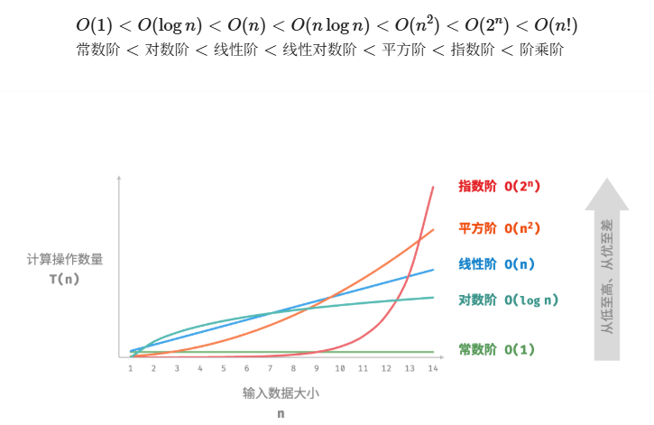
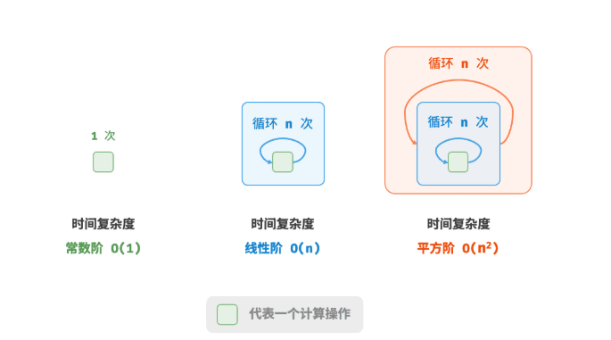
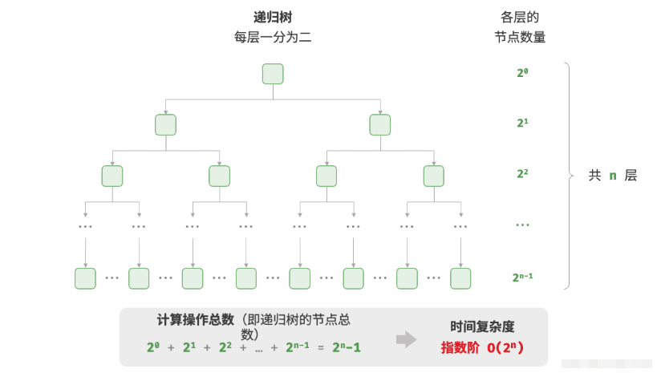
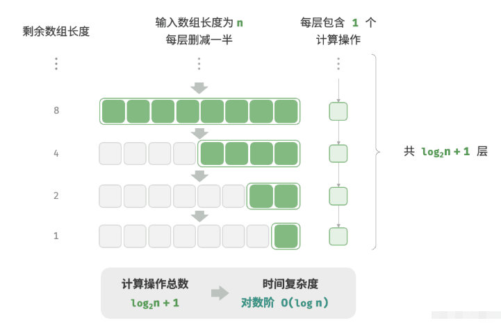
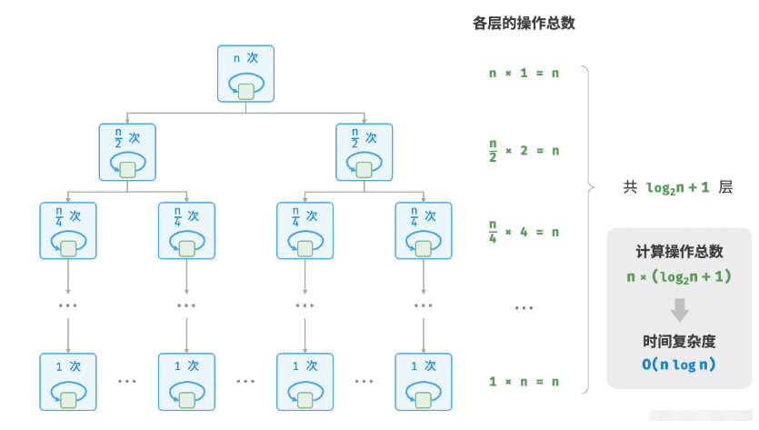
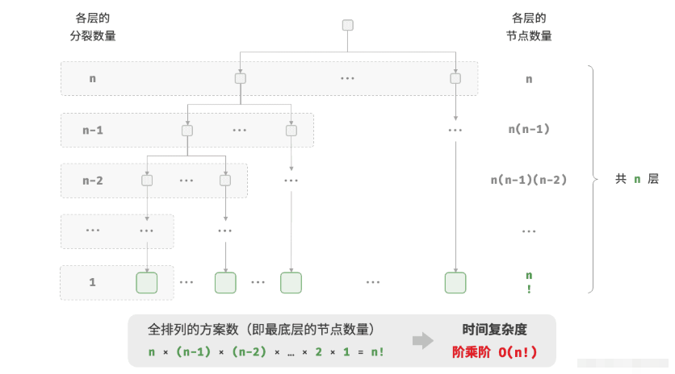

# 算法复杂度分析

## 1 算法效率评估

- `时间效率`和`空间效率`是衡量算法优劣的两个主要评价指标。
- 我们可以通过实际测试来评估算法效率，但难以消除测试环境的影响，且会耗费大量计算资源。
- 复杂度分析可以消除实际测试的弊端，分析结果适用于所有运行平台，并且能够揭示算法在不同数据规模下的效率。

## 2 时间复杂度
- `时间复杂度`用于衡量算法运行时间随数据量增长的趋势，可以有效评估算法效率，但在某些情况下可能失效，如在输入的数据量较小或时间复杂度相同时，无法精确对比算法效率的优劣。
-  最差时间复杂度使用大`O`符号表示，对应函数渐近上界，反映当n趋向正无穷时，操作数量T(n)的增长级别。
- 推算时间复杂度分为两步，首先统计操作数量，然后判断渐近上界。
- 常见时间复杂度从低到高排列有`O(1)` < `O(logn)` < `O(n)` < `O(nlogn)` < `O(n^2)` < `O(2^n)` < `O(n!)`

- 某些算法的时间复杂度非固定，而是与输入数据的分布有关。时间复杂度分为最差、最佳、平均时间复杂度，最佳时间复杂度几乎不用，因为输入数据一般需要满足严格条件才能达到最佳情况。
- 平均时间复杂度反映算法在随机数据输入下的运行效率，最接近实际应用中的算法性能。计算平均时间复杂度需要统计输入数据分布以及综合后的数学期望

### 2.1 时间复杂度的常见类型
#### 2.1.1 常数阶O(1)
常数阶的操作数量与输入输出大小`n`无关，不随输入`n`的变化而变化
以下例子中，尽管操作数量`size`可能很大，但由于其与输入`n`大小无关，因此时间复杂度仍为`O(1)`

<!-- tabs:start -->

## **python**
```python
def constant(n: int) -> int:
    """常数阶"""
	count = 0
	size = 10
	for _ in range(size):
	    count += 1
	return count
```

## **java**
```java
public int constant (Integer n) {
    int constant = 10;
    int res = 0;
    for (int i = 0; i < constant; i++) {
        res++;
    }
    return res;
}
```
<!-- tabs:end -->

+ 可视化运行 +
    <!-- tabs:start -->
    
    ## **python**
    ```pytutor-python
    def constant(n: int) -> int:
        """常数阶"""
        count = 0
        size = 10
        for _ in range(size):
            count += 1
        return count
        
    """Driver Code"""
    if __name__ == "__main__":
        n = 8
        print("输入数据大小 n =", n)
        
        count = constant(n)
        print("常数阶的操作数量 =", count)
    ```
    
    ## **java**
    ```pytutor-java
    public class Main {
    
        public static int constant (Integer n) {
            int constant = 10;
            int res = 0;
            for (int i = 0; i < constant; i++) {
                res++;
            }
            return res;
        }
    
        public static void main(String[] args) {
            int n = 8;
            System.out.println("输入数据大小 n = " + n);
            int res = constant(5);
            System.out.println("常数阶的操作数量 = " + res);
        }
    }
    ```
    <!-- tabs:end -->

#### 2.1.2 线性阶O(n)
线性阶的操作数量相对于输入数据大小 以线性级别增长。线性阶通常出现在`单层循环中`：
<!-- tabs:start -->
## **python**
```python
def linear(n: int) -> int:
    """线性阶"""
	count = 0
	for _ in range(n):
	    count += 1
	return count
	
```

## **java**
```java
public int linear (Integer n) {
   int res = 0;
     for (int i = 0; i < n; i++) {
        res++;
     }
   return res;
}
```
<!-- tabs:end -->

+ 可视化运行 +
    <!-- tabs:start -->
    ## **python**
    ```pytutor-python
    def linear(n: int) -> int:
        """线性阶"""
        count = 0
        for _ in range(n):
            count += 1
        return count
        
    """Driver Code"""
    if __name__ == "__main__":
        n = 8
        print("输入数据大小 n =", n)
        
        count = linear(n)
        print("线性阶的操作数量 =", count)
    ```
    
    ## **java**
    ```pytutor-java
    public class Main {
    
        public static int linear (Integer n) {
            int res = 0;
            for (int i = 0; i < n; i++) {
                res++;
            }
            return res;
        }
    
        public static void main(String[] args) {
            int n = 8;
            System.out.println("输入数据大小 n = " + n);
            int res = linear(5);
            System.out.println("线性阶的操作数量 = " + res);
        }
    }
    ```
    <!-- tabs:end -->

`遍历数组`和`遍历链表`等操作的时间复杂度均为O(n)，其中n为数组或链表的长度：

<!-- tabs:start -->
## **python**
```python
def array_traversal(nums: list[int]) -> int:
    """线性阶（遍历数组）"""
    count = 0
    # 循环次数与数组长度成正比
    for num in nums:
        count += 1
    return count   
```
## **java**
```java
public int arrayTraversal (int[] nums) {
    int res = 0;
    // 循环次数与数组长度成正比
    for (int num : nums) {
       res++;
       }
    return res;
}
```
<!-- tabs:end -->

+ 可视化运行 +
    <!-- tabs:start -->
    ## **python**
    ```pytutor-python
    from typing import List
    def array_traversal(nums: list[int]) -> int:
        """线性阶（遍历数组）"""
        count = 0
        # 循环次数与数组长度成正比
        for num in nums:
            count += 1
        return count
        
    """Driver Code"""
    if __name__ == "__main__":
        n = 8
        print("输入数据大小 n =", n)
        
        count = array_traversal([0] * n)
        print("线性阶(遍历数组)的操作数量 =", count)
    ```
    
    ## **java**
    ```pytutor-java
    public class Main {
    
        public static int arrayTraversal (int[] nums) {
            int res = 0;
            // 循环次数与数组长度成正比
            for (int num : nums) {
                res++;
            }
            return res;
        }
    
        public static void main(String[] args) {
            int n = 8;
            System.out.println("输入数据大小 n = " + n);
            int[] arr = new int[0];
            int res = arrayTraversal(arr);
            System.out.println("线性阶(遍历数组)的操作数量 = " + res);
        }
    }
    ```
    <!-- tabs:end -->

#### 2.1.3 平方阶(O(n^2))
平方阶的操作数量相对于输入数据大小`n`以平方级别增长。平方阶通常出现在`嵌套循环中`，外层循环和内层循环的时间复杂度都为O(n)，因此总体的时间复杂度为O(n^2)：
<!-- tabs:start -->
## **python**
```python
def quadratic(n: int) -> int:
    """平方阶"""
    count = 0
    # 循环次数与数据大小 n 成平方关系
    for i in range(n):
        for j in range(n):
            count += 1
    return count 
```
## **java**
```java
/* 平方阶 */
int quadratic(int n) {
    int count = 0;
    // 循环次数与数据大小 n 成平方关系
    for (int i = 0; i < n; i++) {
        for (int j = 0; j < n; j++) {
            count++;
        }
    }
    return count;
}
```
<!-- tabs:end -->

+ 可视化运行 +
    <!-- tabs:start -->
  ## **python**
    ```pytutor-python
    def quadratic(n: int) -> int:
        """平方阶"""
        count = 0
        # 循环次数与数据大小 n 成平方关系
        for i in range(n):
            for j in range(n):
                count += 1
        return count 
        
    """Driver Code"""
    if __name__ == "__main__":
        n = 8
        print("输入数据大小 n =", n)
        
        count = quadratic(n)
        print("平方阶的操作数量 =", count)
    ```

  ## **java**
    ```pytutor-java
    public class Main {
    
        public static int quadratic(int n) {
            int count = 0;
            // 循环次数与数据大小 n 成平方关系
            for (int i = 0; i < n; i++) {
                for (int j = 0; j < n; j++) {
                    count++;
                }
            }
            return count;
        }
    }
    
        public static void main(String[] args) {
            int n = 8;
            System.out.println("输入数据大小 n = " + n);
            int res = quadratic(n);
            System.out.println("平方阶的操作数量 = " + res);
        }
    }
    ```
    <!-- tabs:end -->

<br>

> [!TIP]
> 下图对比了**常数阶**、**线性阶**、**平方阶**这三种时间复杂度



#### 2.1.4 指数阶(O(2^n))
在实际算法中，指数阶常出现于递归函数中。例如在以下代码中，其递归地一分为二，经过n次分裂后停止，如下图所示

<!-- tabs:start -->
## **python**
```python
def exp_recur(n: int) -> int:
    """指数阶（递归实现）"""
    if n == 1:
        return 1
    return exp_recur(n - 1) + exp_recur(n - 1) + 1
```
## **java**
```java
/* 指数阶（递归实现） */
int expRecur(int n) {
    if (n == 1)
        return 1;
    return expRecur(n - 1) + expRecur(n - 1) + 1;
}
```
<!-- tabs:end -->

+ 可视化运行 +
    <!-- tabs:start -->
  ## **python**
    ```pytutor-python
    def exp_recur(n: int) -> int:
    """指数阶（递归实现）"""
    if n == 1:
        return 1
    return exp_recur(n - 1) + exp_recur(n - 1) + 1
        
    """Driver Code"""
    if __name__ == "__main__":
        n = 8
        print("输入数据大小 n =", n)
        
        count = exp_recur(n)
        print("指数阶（递归实现）的操作数量 =", count)
    ```

  ## **java**
    ```pytutor-java
    public class Main {
    
        public static int expRecur(int n) {
            if (n == 1)
                return 1;
            return expRecur(n - 1) + expRecur(n - 1) + 1;
        }
    
        public static void main(String[] args) {
            int n = 8;
            System.out.println("输入数据大小 n = " + n);
            int res = expRecur(n);
            System.out.println("指数阶（递归实现）的操作数量 = " + res);
        }
    }
    ```
    <!-- tabs:end -->

<br>

> [!WARNING]
> **指数阶**增长非常迅速，在穷举法（暴力搜索、回溯等）中比较常见。对于数据规模较大的问题，指数阶是不可接受的，通常需要使用`动态规划`或`贪心算法`等来解决。

#### 2.1.5 对数阶O(logn)
与指数阶相反，对数阶反映了“每轮缩减到一半”的情况。设输入数据大小为n，由于每轮缩减到一半，因此循环次数是logn，即2^n的反函数。如下图所示



<!-- tabs:start -->
## **python**
```python
def logarithmic(n: int) -> int:
    """对数阶（循环实现）"""
    count = 0
    while n > 1:
        n = n / 2
        count += 1
    return count
```
## **java**
```java
/* 对数阶（循环实现） */
int logarithmic(int n) {
    int count = 0;
    while (n > 1) {
        n = n / 2;
        count++;
    }
    return count;
}
```
<!-- tabs:end -->

+ 可视化运行 +
    <!-- tabs:start -->
  ## **python**
    ```pytutor-python
    def logarithmic(n: int) -> int:
        """对数阶（循环实现）"""
        count = 0
        while n > 1:
            n = n / 2
            count += 1
        return count
        
    """Driver Code"""
    if __name__ == "__main__":
        n = 8
        print("输入数据大小 n =", n)
        
        count = logarithmic(n)
        print("对数阶（循环实现）的操作数量 =", count)
    ```

  ## **java**
    ```pytutor-java
    public class Main {
    
        public static int logarithmic(int n) {
            int count = 0;
            while (n > 1) {
                n = n / 2;
                count++;
            }
            return count;
        }
    
        public static void main(String[] args) {
            int n = 8;
            System.out.println("输入数据大小 n = " + n);
            int res = expRecur(n);
            System.out.println("对数阶（循环实现）的操作数量 = " + res);
        }
    }
    ```
    <!-- tabs:end -->

<br>

> [!TIP]
> 与**指数阶**类似，**对数阶**也常出现于递归函数中。以下代码形成了一棵高度为log2n的递归树.

<br>

<!-- tabs:start -->
## **python**
```python
def log_recur(n: int) -> int:
    """对数阶（递归实现）"""
    if n <= 1:
        return 0
    return log_recur(n / 2) + 1
```
## **java**
```java
/* 对数阶（递归实现） */
int logRecur(int n) {
    if (n <= 1)
        return 0;
    return logRecur(n / 2) + 1;
}
```
<!-- tabs:end -->

+ 可视化运行 +
    <!-- tabs:start -->
  ## **python**
    ```pytutor-python
    def log_recur(n: int) -> int:
        """对数阶（递归实现）"""
        if n <= 1:
            return 0
        return log_recur(n / 2) + 1
        
    """Driver Code"""
    if __name__ == "__main__":
        n = 8
        print("输入数据大小 n =", n)
        
        count = log_recur(n)
        print("对数阶（递归实现）的操作数量 =", count)
    ```

  ## **java**
    ```pytutor-java
    public class Main {
    
        public static int logRecur(int n) {
            if (n <= 1)
                return 0;
            return logRecur(n / 2) + 1;
        }
    
        public static void main(String[] args) {
            int n = 8;
            System.out.println("输入数据大小 n = " + n);
            int res = logRecur(n);
            System.out.println("对数阶（递归实现）的操作数量 = " + res);
        }
    }
    ```
    <!-- tabs:end -->

<br>

> [!TIP]
> **对数阶**常出现于基于分治策略的算法中，体现了“一分为多”和“化繁为简”的算法思想。它增长缓慢，是`仅次于常数阶的理想的时间复杂度`。

#### 2.1.6 线性对数阶(O(nlogn))
线性对数阶常出现于嵌套循环中，两层循环的时间复杂度分别为O(logn)和O(n),下图展示了人线性对数阶的生成方式，二叉树的每一层操作总数都为n，树共有logn+1层，因此时间复杂度为O(nlogn)


<!-- tabs:start -->
## **python**
```python
def linear_log_recur(n: int) -> int:
    """线性对数阶"""
    if n <= 1:
        return 1
    # 一分为二，子问题的规模减小一半
    count = linear_log_recur(n // 2) + linear_log_recur(n // 2)
    # 当前子问题包含 n 个操作
    for _ in range(n):
        count += 1
    return count
```
## **java**
```java
/* 线性对数阶 */
int linearLogRecur(int n) {
    if (n <= 1)
        return 1;
    int count = linearLogRecur(n / 2) + linearLogRecur(n / 2);
    for (int i = 0; i < n; i++) {
        count++;
    }
    return count;
}
```
<!-- tabs:end -->

+ 可视化运行 +
    <!-- tabs:start -->
  ## **python**
    ```pytutor-python
    def linear_log_recur(n: int) -> int:
        """线性对数阶"""
        if n <= 1:
            return 1
        # 一分为二，子问题的规模减小一半
        count = linear_log_recur(n // 2) + linear_log_recur(n // 2)
        # 当前子问题包含 n 个操作
        for _ in range(n):
            count += 1
        return count
        
    """Driver Code"""
    if __name__ == "__main__":
        n = 8
        print("输入数据大小 n =", n)
        
        count = log_recur(n)
        print("对数阶（递归实现）的操作数量 =", count)
    ```

  ## **java**
    ```pytutor-java
    public class Main {
    
        public static int linearLogRecur(int n) {
            if (n <= 1)
                return 1;
            int count = linearLogRecur(n / 2) + linearLogRecur(n / 2);
                for (int i = 0; i < n; i++) {
                    count++;
                }
            return count;
        }
    
        public static void main(String[] args) {
            int n = 8;
            System.out.println("输入数据大小 n = " + n);
            int res = logRecur(n);
            System.out.println("对数阶（递归实现）的操作数量 = " + res);
        }
    }
    ```
    <!-- tabs:end -->

<br>

> [!TIP]
> 主流排序算法的时间复杂度通常为O(nlogn)，例如快速排序、归并排序、堆排序等。

#### 2.1.7 阶乘阶O(n!)
阶乘阶对应数学上的“全排列”问题。给定n个互不重复的元素，求其所有可能的排列方案，方案数量为：
*n! = n * (n-1) * (n-2) * ... * 2 * 1*
阶乘通常使用递归实现。如图下图和代码所示，第一层分裂出n个，第二层分裂出n-1个，以此类推，直至第n层时停止分裂：


<!-- tabs:start -->
## **python**
```python
def factorial_recur(n: int) -> int:
    """阶乘阶（递归实现）"""
    if n == 0:
        return 1
    count = 0
    # 从 1 个分裂出 n 个
    for _ in range(n):
        count += factorial_recur(n - 1)
    return count
```
## **java**
```java
/* 阶乘阶（递归实现） */
int factorialRecur(int n) {
    if (n == 0)
        return 1;
    int count = 0;
    // 从 1 个分裂出 n 个
    for (int i = 0; i < n; i++) {
        count += factorialRecur(n - 1);
    }
    return count;
}
```
<!-- tabs:end -->

+ 可视化运行 +
    <!-- tabs:start -->
  ## **python**
    ```pytutor-python
    def factorial_recur(n: int) -> int:
        """阶乘阶（递归实现）"""
        if n == 0:
            return 1
        count = 0
        # 从 1 个分裂出 n 个
        for _ in range(n):
            count += factorial_recur(n - 1)
        return count
        
    """Driver Code"""
    if __name__ == "__main__":
        n = 8
        print("输入数据大小 n =", n)
        
        count = factorial_recur(n)
        print("阶乘阶（递归实现）的操作数量 =", count)
    ```

  ## **java**
    ```pytutor-java
    public class Main {
    
        public static int factorialRecur(int n) {
            if (n == 0)
                return 1;
            int count = 0;
            // 从 1 个分裂出 n 个
            for (int i = 0; i < n; i++) {
                count += factorialRecur(n - 1);
            }
            return count;
        }
    
        public static void main(String[] args) {
            int n = 8;
            System.out.println("输入数据大小 n = " + n);
            int res = logRecur(n);
            System.out.println("阶乘阶（递归实现）的操作数量 = " + res);
        }
    }
    ```
    <!-- tabs:end -->

## 3 空间复杂度
- `空间复杂度`的作用类似于时间复杂度，用于衡量算法占用内存空间随数据量增长的趋势。
- 算法运行过程中的相关内存空间可分为输入空间、暂存空间、输出空间。通常情况下，输入空间不纳入空间复杂度计算。暂存空间可分为暂存数据、栈帧空间和指令空间，其中栈帧空间通常仅在递归函数中影响空间复杂度。
- 我们通常只关注最差空间复杂度，即统计算法在最差输入数据和最差运行时刻下的空间复杂度。
- 常见空间复杂度从低到高排列有`O(1)` < `O(logn)` < `O(n)` < `O(nlogn)` < `O(n^2)`