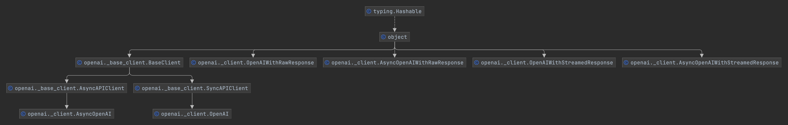
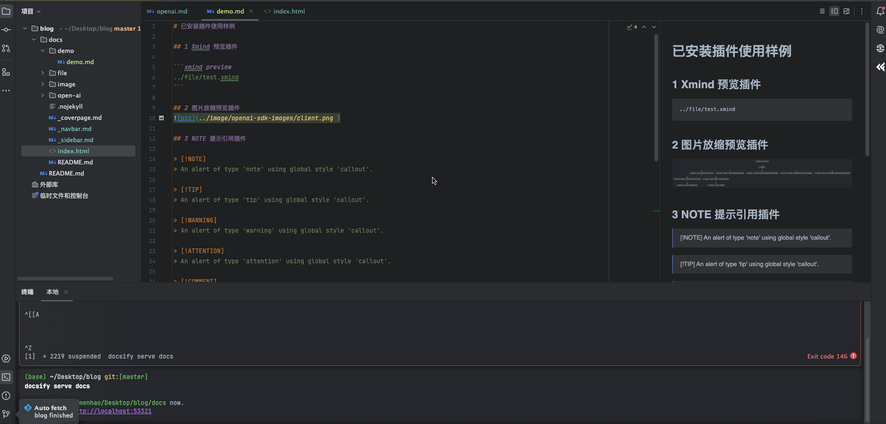

# 已安装插件使用样例

## 1 Xmind 预览插件

```xmind preview 
./file/test.xmind
```
/blog/docs/file/test.xmind

## 2 图片放缩预览插件


## 3 NOTE 提示引用插件

> [!NOTE]
> An alert of type 'note' using global style 'callout'.

> [!TIP]
> An alert of type 'tip' using global style 'callout'.

> [!WARNING]
> An alert of type 'warning' using global style 'callout'.

> [!ATTENTION]
> An alert of type 'attention' using global style 'callout'.

> [!COMMENT]
> An alert of type 'comment' using style 'callout' with default settings.

## 4 table 插件
<!-- tabs:start -->

#### **English**

Hello!

#### **French**

Bonjour!

#### **Italian**

Ciao!

<!-- tabs:end -->

## 5 GIF图片

### 5.1 hover播放

### 5.2 点击播放

### 5.3 直接播放


## 6 图片滑块插件

[]: # [[slider]](./image/icon.jpg|./image/openai-sdk-images/client.png)


## 7 防X帖子样式插件

<!-- x:start -->
<!-- avatarUrl:'https://pbs.twimg.com/profile_images/1893803697185910784/Na5lOWi5_400x400.jpg' -->
<!-- imageUrl:'https://pbs.twimg.com/media/GobIp2wX0AE9zOp?format=jpg&name=small' -->
<!-- username:kevin -->
<!-- userId:kevin12134 -->
<!-- timestamp:Apr 13 -->
<!-- likes:13423 -->
<!-- retweets:13423 -->
<!-- comments:123 -->
<!-- views:321 -->
这是你的 x 帖子的主要内容。
它可以跨越多行。

很高兴认识你！你好，docsify-xpost！
<!-- x:end -->

## 8 折叠样式插件

### FAQ Section

Introduction text for the FAQ page.

+ Question 1? +

  Answer 1

+ Question 2? +

  Answer 2


## 9 DRAWIO插件
[file](../file/client.drawio ':include :type=code')

