# 工单执行平台与运营管理中台项目说明

## 1. 文档说明

### 1.1 文档目标

本文档将两个项目统一整理为一份可交付的综合文档，覆盖以下四类视角：

1. 开发视角：项目结构、模块职责、技术架构、调用链路、数据库设计、核心代码运行机制。
2. 运营视角：核心业务流程、组织角色、业务节点、异常分支、指标口径。
3. 运维视角：部署架构、运行依赖、配置中心、定时任务、链路稳定性、巡检建议。
4. 产品视角：产品定位、角色权限、页面能力、业务闭环、系统边界。

### 1.2 资料来源

本文档基于以下内容整理：

1. 工单执行平台仓库源码、SQL、BPMN 流程文件、截图目录 `system-image`。
2. 运营管理中台仓库源码、初始化 DML、鉴权/租户/权限/用户/公告/打标相关实现。
3. 两个项目的 Maven 聚合结构、启动配置、Nacos/Dubbo/MyBatis/任务执行代码。
4. 本文档配图目录 `../image/smart-work-order` 中生成的高清 PNG 图片。

### 1.3 重要说明

1. 当前目录中未发现中台前端工程，因此关于中台的页面与产品交互，主要依据后端 API、实体、权限模型与业务命名进行反推。
2. 运营管理中台仓库未提供完整 DDL，仅提供初始化 DML，因此中台数据库设计部分主要根据 DO、Mapper、Service、Core 进行结构化归纳。
3. 工单执行平台的业务流程与页面逻辑，可以直接由 BPMN、定时任务、服务实现以及 `system-image` 截图交叉验证。
4. 文档中的“推断”均来自代码上下文，不代表外部正式制度文件。
5. 文档中的系统名称已统一脱敏处理，不再出现仓库原始名称。

---

## 2. 双项目总体结论

### 2.1 项目定位

两个项目本质上是一个业务域内的双系统协作架构：

1. 运营管理中台：统一服务中台/后台底座，负责多租户、登录鉴权、组织架构、角色权限、字典分类、公告消息、系统用户、智能打标任务等通用能力。
2. 工单执行平台：审单业务执行平台，负责工单导入、工单池、材料补充、智能判责、规则引擎、工单分派、审核复核、申辩关单、批量报告分析、业务看板。

### 2.2 双系统关系

可以把两个系统理解为：

1. 运营管理中台提供基础治理能力。
2. 工单执行平台提供具体的审单业务执行能力。
3. 工单执行平台通过 Dubbo 依赖中台接口获取用户、组织、分类、租户相关信息。
4. 工单执行平台自身再对接流程引擎、模型服务、ASR/OCR、OSS、批处理任务与规则引擎。

### 2.3 一句话概括

运营管理中台是“统一权限与租户中台”，工单执行平台是“带工作流和 AI 判责能力的审单工单平台”。

---

## 3. 总体架构概览

### 3.1 技术栈总览

两个项目的共同技术底座高度一致：

1. JDK 1.8
2. Spring Boot 2.7.1
3. Dubbo 3.0.10
4. Nacos 2.1.1
5. MyBatis / MyBatis-Plus
6. OceanBase 驱动
7. 自研中间件：DDS、DCH、LDC、OSS、SOFA Tracer、Sentinel、MGS

### 3.2 聚合模块结构

#### 运营管理中台

1. `api`：对外服务接口与 DTO。
2. `auth`：认证、鉴权、JWT、租户切面、Spring Security 上下文。
3. `common`：通用返回、异常、工具类、常量。
4. `core`：领域核心逻辑。
5. `dal`：DO、Mapper、Mapper XML。
6. `integration`：短信/外部消息等对接。
7. `manager`：Manager 层，对 DB 访问与 BO 编排。
8. `service`：Dubbo 服务暴露层。
9. `start`：主服务启动模块。
10. `task`：任务/消费独立进程。
11. `tests`：测试与冒烟测试。
12. `trigger`：预留触发层。

#### 工单执行平台

1. `api`：工单、工单池、任务、模板、看板、规则等服务接口。
2. `common`：通用常量、枚举、工具、配置实体。
3. `core`：工单流程、模型调用、规则执行、自动分单、批处理核心逻辑。
4. `dal`：工单主表、附件表、规则表、批任务表等数据层。
5. `integration`：对接中台、工作流、模型、ASR/OCR、手机号校验。
6. `manager`：领域数据聚合与查询编排。
7. `service`：Dubbo 服务实现层。
8. `start`：主服务启动模块。
9. `task`：任务进程预留。
10. `trigger`：Job Proxy 接口定义。
11. `tests`：测试与冒烟测试。

### 3.3 组件关系图

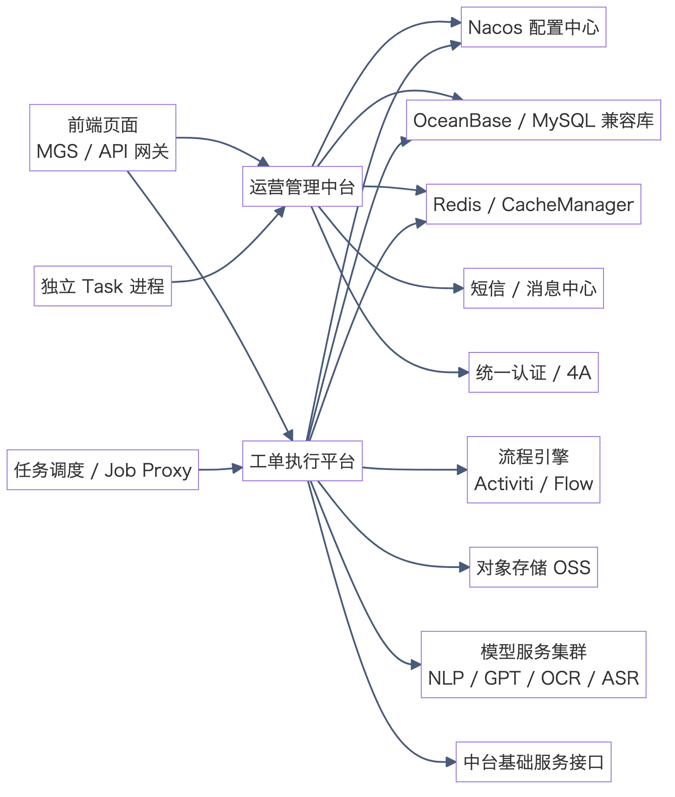

---

## 4. 开发文档

## 4.1 运营管理中台开发文档

### 4.1.1 项目职责

运营管理中台承担统一服务底座角色，核心职责包括：

1. 登录认证：账号密码登录、短信验证码校验、4A SSO 登录、省集约一键登录。
2. 多租户治理：租户上下文、租户隔离、租户套餐、租户容量控制。
3. 权限中心：角色、菜单、按钮权限、角色授权、角色用户绑定。
4. 组织中心：部门树、组织架构、按部门查询人员。
5. 用户中心：用户新增、导入、冻结、解冻、批量处理、手机号/账号唯一性校验。
6. 字典与分类：字典、字典项、分类树、子分类查询。
7. 公告消息：公告发布、发送记录、指定用户/全员通知。
8. 智能打标：批量上传 Excel，提交算法平台打标，轮询任务状态并回写。

### 4.1.2 典型模块职责

| 模块                                  | 主要职责                                |
|-------------------------------------|-------------------------------------|
| `auth`                              | 认证切面、租户切面、JWT、Token 缓存、Security 上下文 |
| `service/syslogin`                  | 登录、验证码、短信发送、登出、4A 对接                |
| `service/sysuser`                   | 用户分页、导入导出、冻结解冻、角色绑定                 |
| `service/sysrole`                   | 角色 CRUD、角色授权、角色用户管理                 |
| `service/syspermission`             | 菜单树、按钮权限、权限查询                       |
| `service/systenant`                 | 租户、套餐、容量、租户恢复与回收站                   |
| `service/sysannouncement`           | 公告发布、撤销、发送记录                        |
| `service/IntelligentMarkingService` | 智能打标任务创建、轮询、更新                      |
| `core`                              | 事务型领域逻辑                             |
| `manager + dal`                     | SQL 组织、BO/DO 映射、分页查询                |

### 4.1.3 认证与权限链路

#### 登录时序图

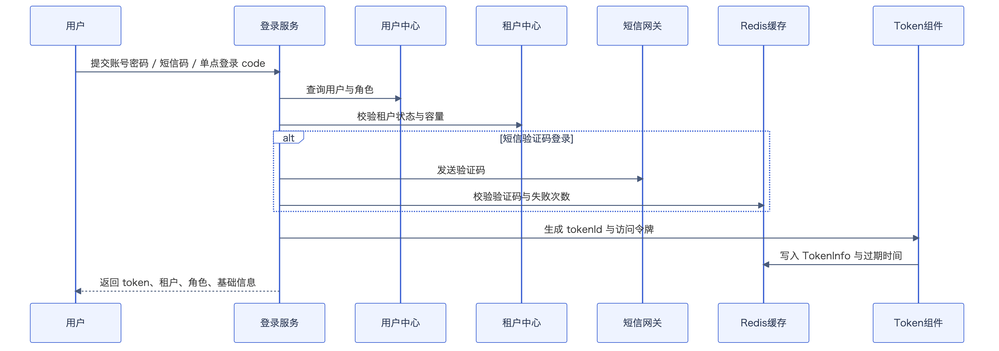

#### 服务鉴权链路

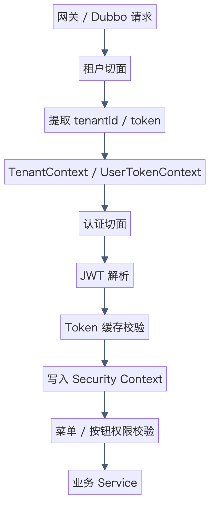

### 4.1.4 多租户设计

系统采用“线程上下文 + MyBatis-Plus TenantLineInnerInterceptor + MyBatisInterceptor 自动注入”的多租户方案：

1. `TenantAspect` 在方法入口提取 `tenantId`，写入 `TenantContext`。
2. `MybatisPlusSaasConfig` 对 `system_role`、`system_user`、`system_depart`、`system_log`、`system_announcement`、`t_workorder_type_info` 等表自动追加 `tenant_id` 条件。
3. `MybatisInterceptor` 在插入时自动补齐 `createdBy`、`createdAt`、`updatedBy`、`updatedAt`、`tenantId`。
4. 超级管理员租户 `tenantId=0` 直接放行，不走租户隔离。

### 4.1.5 数据库设计

由于仓库未提供完整中台 DDL，以下结构根据 DO/Mapper 反推。

#### 数据库逻辑 ER 图

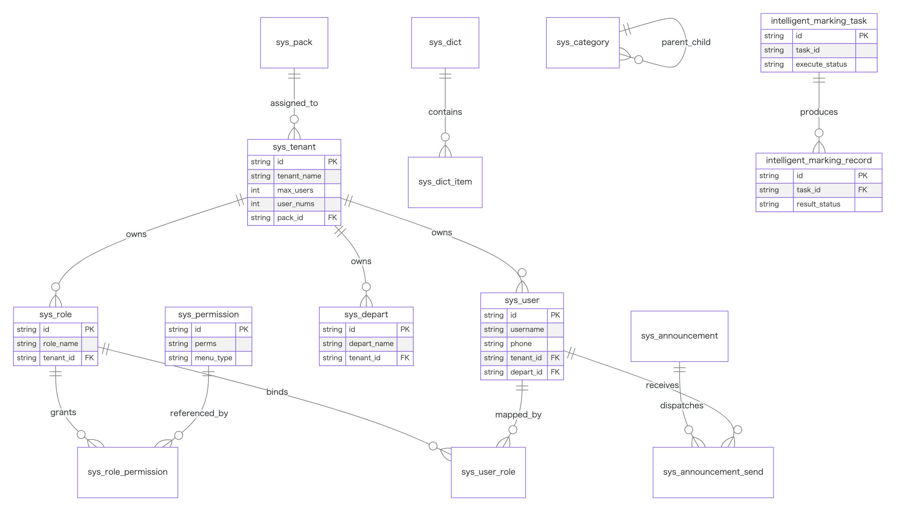

#### 核心主表

| 表名                                            | 作用          | 关键字段                                                                     |
|-----------------------------------------------|-------------|--------------------------------------------------------------------------|
| `system_user`                                 | 系统用户        | `username` `realname` `phone` `status` `work_no` `tenant_id` `user_code` |
| `system_role`                                 | 系统角色        | `role_name` `role_code` `tenant_id`                                      |
| `system_permission`                           | 菜单与按钮权限     | `parent_id` `name` `menu_type` `perms` `component` `status`              |
| `system_tenant`                               | 租户          | `tenant_name` `tenant_status` `max_users` `pack_id` `user_nums`          |
| `system_depart`                               | 部门组织        | 部门编码、上级编码、层级树                                                            |
| `system_dict` / `system_dict_item`            | 数据字典与字典项    | 编码、名称、值                                                                  |
| `system_category`                             | 分类字典/树形分类   | `code` `name` `parent_id`                                                |
| `system_announcement`                         | 公告消息        | `title` `msg_content` `msg_type` `send_status` `tenant_id`               |
| `system_announcement_send`                    | 公告发送记录      | 公告与用户关联、已读未读                                                             |
| `system_user_role` / `system_role_permission` | 角色用户/角色权限关系 | `user_id` `role_id` `perm_id`                                            |
| `system_pack`                                 | 套餐包         | 套餐名称、租户能力边界                                                              |
| `intelligent_marking_task`                    | 智能打标任务      | `task_id` `task_name` `task_status` `task_result`                        |

#### 关键关系

1. `system_user.tenant_id -> system_tenant.id`
2. `system_user_role.user_id -> system_user.id`
3. `system_user_role.role_id -> system_role.id`
4. `system_role_permission.role_id -> system_role.id`
5. `system_role_permission.permission_id -> system_permission.id`
6. `system_tenant.pack_id -> system_pack.id`
7. `system_announcement_send.announcement_id -> system_announcement.id`

### 4.1.6 核心代码运行逻辑

#### 核心一：`SysLoginServiceImpl`

职责：

1. 统一承接三种登录模式：账号密码、4A SSO、手机号快速登录。
2. 做验证码、短信码、登录失败次数、租户过滤、账号冻结校验。
3. 登录成功后通过 `JwtUtil.generateToken` 生成 JWT，并把 `TokenInfoBO` 存入缓存。

运行逻辑：

1. 判断是否带 `code`，若带则走 4A。
2. 若带 `bsetpayPhoneNumber`，走省集约快捷登录。
3. 否则走普通账号密码登录。
4. 登录成功后返回 token、用户身份、租户、会话信息。

#### 核心二：`CustomUserDetailsService`

职责：

1. 负责 token 缓存读写。
2. 将 JWT 中的 `tokenId` 转成 Spring Security 可识别的 `UserDetails`。
3. 为切面与 MyBatis 拦截器提供当前用户身份。

运行逻辑：

1. 从请求头或线程上下文拿到 token。
2. 用 `JwtUtil.resolveTokenWitFresh` 解析 JWT。
3. 用 `tokenId` 到缓存取 `TokenInfoBO`。
4. 校验 `TenantContext` 与 token 内租户是否匹配。
5. 写入 `SecurityContextHolder`。

#### 核心三：`TenantAspect + AuthAspect`

职责：

1. `TenantAspect` 优先设置租户上下文。
2. `AuthAspect` 再完成权限身份上下文初始化。
3. 业务方法只需要写 `@PreAuthorize` 即可。

优点：

1. 把租户隔离和权限校验从业务代码里抽走。
2. 服务层不需要手写重复鉴权逻辑。
3. 与 Dubbo/MGS 的 Header 体系兼容。

#### 核心四：`SysUserServiceImpl`

职责：

1. 用户分页、导入、导出、冻结、解冻、批量删除。
2. 用户导入采用“先全量校验，再整体导入”的严格策略。
3. 与租户容量、角色、部门联动。

运行特点：

1. 导入 Excel 前先做格式校验。
2. 校验用户名、手机号、角色、部门、租户容量。
3. 全量校验通过后批量入库。
4. 失败时优先根据唯一索引信息给出明确错误。

#### 核心五：`IntelligentMarkingServiceImpl`

职责：

1. 接收 Excel 数据。
2. 调用算法平台进行打标。
3. 保存任务状态。
4. 定时轮询任务进度。

运行逻辑：

1. `addMarkingTask` 创建任务并提交算法。
2. `updateMarkingTask` 通过分布式锁轮询执行中任务。
3. 算法完成后，更新任务状态与打标结果。

### 4.1.7 并发与稳定性设计

#### 已确认的控制手段

1. JWT + Redis：通过 `tokenId` 控制会话续期与失效。
2. 登录失败计数：防止短时间暴力尝试。
3. `MybatisPlus` 乐观锁插件：减少并发覆盖更新风险。
4. `UserNumsEventListener`：通过“旧值 -> 新值”的 compare-and-update 风格更新租户用户量，保证强一致。
5. 智能打标轮询任务使用分布式锁：避免多节点重复轮询。
6. `sendMessageByPhoneNumber` 使用 `DCHLock`：避免短信重复发送。

#### 高并发场景建议

1. 对 `system_user(username, tenant_id)`、`system_user(phone, tenant_id)`、`system_role(role_code, tenant_id)` 维持唯一索引。
2. 对登录失败计数、短信验证码、token 会话过期做统一 TTL 管理。
3. 对公告下发、导入任务、打标任务建议增加任务流水表与重试状态机。
4. 若用户量增长明显，建议把“用户导入校验”和“用户创建”拆为异步批任务。

### 4.1.8 运维关注点

1. 依赖 Nacos 配置与加密配置，启动时必须保证 `spring.application.name`、Nacos namespace/group/dataId 正确。
2. 鉴权严重依赖 Redis/CacheManager，缓存不可用会直接影响登录态与鉴权。
3. 4A 登录依赖外部 SSO，可单独做健康检查。
4. 短信下发依赖消息中心/网关桥接服务。

### 4.1.9 量化容量指标与成因

以下指标为基于当前代码默认参数、线程池策略、缓存与锁设计推导出的保守工程估算，用于内部方案说明，不作为对外 SLA 承诺。

| 指标项      | 建议规划值                                       | 形成原因                                                                     |
|----------|---------------------------------------------|--------------------------------------------------------------------------|
| 中台在线操作会话 | 单节点建议 `200 ~ 300` 个并发会话；双节点建议 `400 ~ 600` 个 | 主要请求为登录、分页、权限查询与 CRUD；登录态走 Redis 缓存，菜单权限走上下文校验，数据库以管理台场景为主，属于典型中后台读多写少负载 |
| 短信发送防重   | 同手机号同业务键严格串行                                | `sendMessageByPhoneNumber` 已使用 `DCHLock`，可避免瞬时重复点击造成短信风暴                 |
| 用户导入容量   | 单次建议 `500 ~ 1000` 条；超出后拆为异步批任务              | 当前导入逻辑已具备批量预校验和批量写入能力，但会同时校验角色、部门、租户人数，属于中等写入压力场景                        |
| 智能打标任务并发 | 单节点建议同时运行 `10 ~ 20` 个打标任务轮询                 | 轮询任务已使用分布式锁防重复执行，数据库落点集中在任务状态表，适合多任务但不适合无限并发膨胀                           |

原因总结：

1. 中台接口以登录、权限、组织、用户管理为主，单请求 CPU 压力通常低于模型型业务。
2. Redis 负责 token、验证码、失败次数等热点状态，显著降低数据库在认证场景下的读压。
3. `DCHLock`、乐观锁和 compare-and-update 风格事件更新，使热点资源不容易被并发写穿。
4. 中台并发上限更多受数据库连接池、Redis 可用性和网关限流策略影响，而不是单个业务方法的纯 CPU 运算能力。

---

## 4.2 工单执行平台开发文档

### 4.2.1 项目职责

工单执行平台是审单业务执行平台，围绕“工单从导入到关单”的完整生命周期构建，核心职责如下：

1. 工单导入与工单池管理。
2. 材料补充、附件上传、简化单信息维护。
3. 前置模型判断：有效单、重复单、简化单识别。
4. 智能判责：大模型/小模型、ASR/OCR、规则引擎。
5. 自动/手动分单。
6. 审核、复核、申辩、确认、关单。
7. 报告批量分析、工单批量导入、批量测试。
8. 业务数据看板、智能模型看板。

### 4.2.2 页面能力概览

根据 `system-image` 截图，可确认当前平台至少包含以下菜单能力：

1. 工单池
2. 工单工作台
3. 接口测试
4. 工单管理
5. 可视化看板
6. 复核人员工单工作台
7. 智能打标
8. 短信签名
9. 工单中心
10. 能力中心

工单详情页已经具备：

1. 系统信息
2. 基本信息
3. 工单业务信息
4. 智能判责结果
5. 省侧判责结果
6. 集团复核结果
7. 判责过程 trace 与说明

### 4.2.3 核心技术结构

| 模块                       | 主要职责                    |
|--------------------------|-------------------------|
| `service/smartordertask` | 工单详情、审核、复核、取回、退回等服务入口   |
| `service/orderpool`      | 工单池分页、可分配人员查询、手工分单      |
| `service/smartorder`     | 批量导入、导出、模板下载            |
| `core/smartorder`        | 工作流启动、任务完成、模型调用结果落库     |
| `core/smartordertask`    | 核心业务流转、附件保存、审核/复核/取回/退回 |
| `core/rules`             | 规则表达式执行、结果生成、缓存与异步测试    |
| `core/suborder`          | 自动分单                    |
| `core/batchtaskmanage`   | 报告解析、批量导入、批量测试          |
| `integration/workflow`   | 工作流引擎对接                 |
| `integration/cms`        | 组织、人员、分类等基础能力获取         |
| `integration/smartorder` | NLP、GPT、OCR、ASR、文件识别    |
| `trigger + service/job`  | Job Proxy 定时任务定义与实现     |

### 4.2.4 工单生命周期

最新版 BPMN 可以抽象为如下主流程：

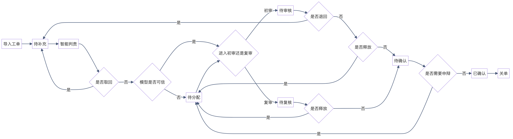

### 4.2.5 审单业务泳道图

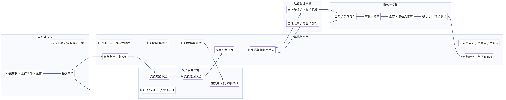

### 4.2.6 关键时序图

#### 工单导入到进入智能判责

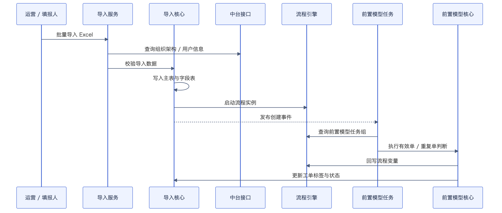

#### 补充材料后进入大模型与规则引擎

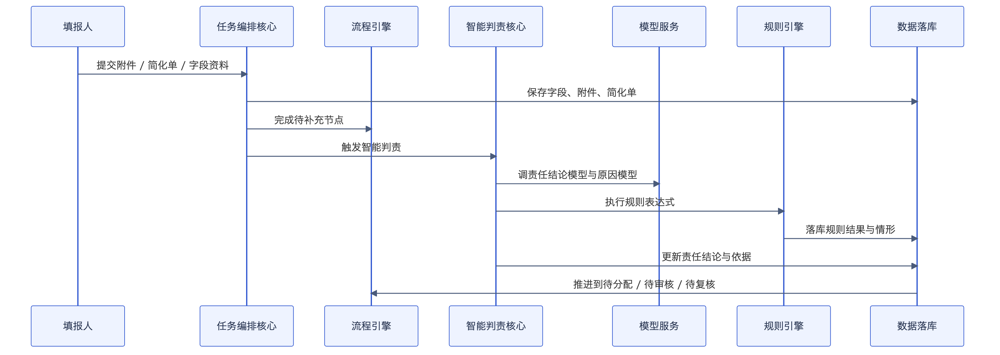

### 4.2.7 工作流版本演进解读

从仓库中的 BPMN 文件可以看到，流程是持续演进的：

1. 早期版本包含：导入、待补充、智能判责、待分配、待审核、待复核、确认、关单。
2. 中间版本新增了“是否初审/复审”路由。
3. 后续版本加入了“模型是否可信”，用于区分模型直达与人工分配。
4. 最新版本又加入了“取回”“退回”“释放”等逆向回流动作。

这说明系统不是简单审批流，而是明显面向实际运营场景不断扩展的“可逆工作流”。

### 4.2.8 调用链路

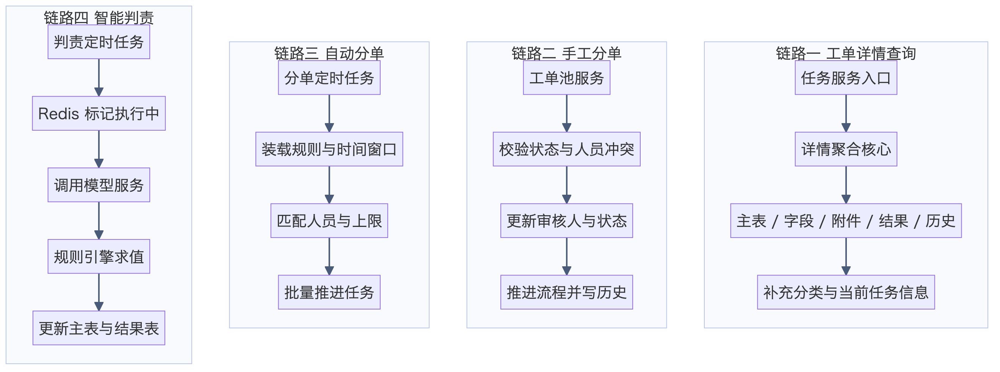

#### 链路一：工单详情查询

1. `SmartOrderTaskServiceImpl.queryTaskDetailsById`
2. `OrderTaskCore.queryTaskDetailsById`
3. `SmartorderInfoManager.querySmartOrderDetailById`
4. 聚合主表、字段表、附件表、规则结果表、历史表
5. 调 `CmsCategoryIntegration` 补打标选项
6. 调 `WorkflowIntegration.queryLastTaskIdByInstNo` 获取当前 taskId
7. 返回前端详情页模型

#### 链路二：手工分单

1. `OrderPoolServiceImpl.handSubOrder`
2. 校验工单当前状态是否仍为前端传入状态
3. 查当前审核人避免冲突
4. 查询流程最新 taskId
5. 更新工单审核人、工单状态
6. `SmartOrderCore.completeTask` 推进工作流
7. 发布 `SmartOrderFlowEvent`
8. `SmartOrderFlowHandler` 写入任务历史

#### 链路三：自动分单

1. `SeparateOrderJobImpl.execute`
2. `AutoDivideCore.doAutoDivide`
3. 查启用的分单规则与时间窗口
4. 查待分配工单
5. 查业务标签下审核人员
6. 轮询或按负载分配
7. 工作流推进 + 主表更新 + 历史记录

#### 链路四：智能判责

1. `SimpleAndDutyOrderJobImpl.execute`
2. 查 `SMART_RESPONSIBLE` 状态工单
3. 用 Redis 标记“正在执行”
4. `OrderTaskCore.runExecuteTask`
5. `SmartOrderNlpCore.doSpecialOrder`
6. `GptIntegration.doDutyModel`
7. `RuleExecCore.execute`
8. `SmartOrderCore.updateSmartOrderByJob`
9. 写规则结果、智能责任依据、责任子表

### 4.2.8.1 Trace 流程执行记录

工单详情页的每条规则后至少有两个动作：

1. `说明`：以表格方式展示步骤名称、执行结果、过程数据、模型输入、模型输出。
2. `trace`：以路径图方式展示规则执行分支，区分已执行路径和未执行路径。
3. `查看表达式` 与 `重置布局`：说明页面支持表达式回看和图布局重排。

需要说明的边界：

1. 当前工作区没有配套前端工程，因此前端交互实现细节是根据截图、返回 DTO 和后端聚合逻辑反推。
2. 代码中可以直接确认“规则结果、耗时、开始结束时间、任务历史、录音转写、执行进度”这些数据来源。
3. 截图里“模型输入/模型输出”这一层的细粒度步骤明细，在仓库中没有发现独立长期存储表，因此这里明确判断它更像是由运行态 trace、规则调试结果或服务日志回放出来的页面能力，而不是单独永久落库的功能。

#### Trace 总体结构图

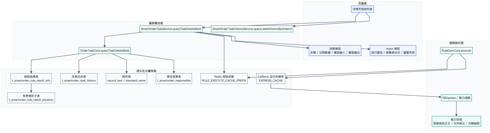

#### Trace 时序图

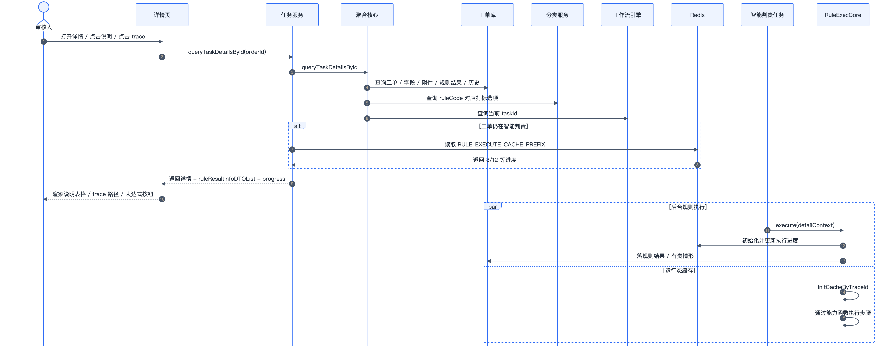

#### Trace 泳道图

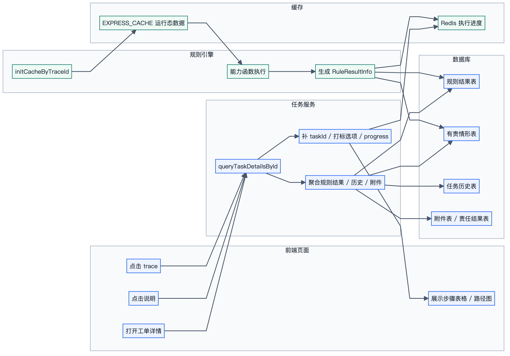

#### Trace 数据与缓存 ER 图

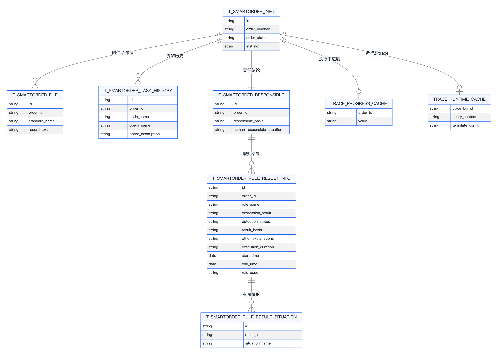

#### Trace 页面层逻辑

1. 页面以规则列表为主视图，每条规则至少展示规则名、检测状态、结果依据、标签结果、备注说明、`说明` 入口和 `trace` 入口。
2. 点击 `说明` 后，页面会把单条规则拆成步骤明细视图；截图中已经能看到“获取报告正文”“调用模型：报告内业务信息提取”“业务信息总提取”等步骤名。
3. 点击 `trace` 后，页面会把规则表达式展开成可布局的执行路径图，绿色路径表示已执行，灰色路径表示未执行。
4. 如果工单仍处于智能判责中，页面优先显示 `ruleExecuteProcess` 进度或预计剩余时间，而不是直接显示完整 trace 结果。
5. 对处于待审核、待复核、待确认、已确认的规则项，页面还会加载分类打标下拉项，支持人工修正。

#### Trace 后端聚合逻辑

1. `SmartOrderTaskServiceImpl.queryTaskDetailsById` 是详情页、`说明` 弹层和 `trace` 弹层的统一数据入口，不是再单独查一套 trace 服务。
2. 该入口会调用 `OrderTaskCore.queryTaskDetailsById` 聚合主表、字段表、附件表、规则结果表、责任结果表、任务历史表。
3. 聚合完成后，服务层把 `ruleResultInfoBOList` 映射成 `RuleResultInfoDTO`，其中已经包含 `expressionResult`、`detectionStatus`、`resultBasis`、`responsibilitySituationList`、`otherExplanations`、`executionDuration`、`startTime`、`endTime`、`ruleCode`、`tagResult`、`remark` 等页面直接可用字段。
4. 如果当前状态是 `SMART_RESPONSIBLE`，服务层会调用 `processOrderStatus` 从 Redis 读取 `RULE_EXECUTE_CACHE_PREFIX + orderId`，把执行进度写到 `ruleExecuteProcess`；如果缓存已消失，则回退为异常状态或剩余时长估算。
5. 服务层还会额外调用 `CmsCategoryIntegration.querySonListByCodes` 给规则项补打标选项，并调用 `WorkflowIntegration.queryLastTaskIdByInstNo` 补当前流程任务号。

#### Trace 规则执行逻辑

1. `RuleExecCore.execute` 会先按工单类型、工单标签、简化单类型、业务标签筛出当前工单适用的规则集合。
2. 进入 `execRuleList` 后，会先调用 `initCacheByTraceId()` 生成或继承 `traceLogId`，并在 `EXPRESS_CACHE` 中放入 `ExpressCacheBO`。
3. 规则上下文统一由 `buildBusinessContext` 构造，核心上下文对象有 `业务信息`、`证明附件`、`证明文字`、`智能判责数据`。
4. `QlExpressUtil` 在启动时会把所有 `BasicCapabilitiesProvider` 注册为可调用函数，因此规则表达式中的“获取报告正文”“文件类型模型转义”“业务办理日期抽取”等中文步骤，最终都会映射到具体 Java 能力类执行。
5. 每执行完一条规则，系统都会把 `i/allRuleCount` 写入 Redis 进度键，所以前端能够看到 `3/12` 这类执行进度值。
6. 规则执行结束后，系统会把 `RuleResultInfoBO` 落库，并清理 `EXPRESS_CACHE` 和 Redis 进度键。

#### Trace 对应的核心能力示例

1. `ErrorAcknowledgelDataCap` 对应截图中的“获取报告正文”，负责从手写报告或模板基础信息中拼出报告正文，并写入 `ExpressCacheBO.queryContent`。
2. `FileTypeTranslationGPTCap` 与同类附件转义能力负责把原始附件名转换为规则可识别的标准问类型，决定后续步骤读取哪一类材料。
3. `SmartOrderNlpCap` 会调用智能审单能力，并把判定结果挂到当前上下文，供后续规则组合使用。
4. `AbstractCapabilities.invoke` 在所有能力执行前后统一打日志，因此 trace 的步骤边界天然与能力类边界一致。

#### Trace 的存储设计结论

1. 当前仓库没有发现专门的 `trace_detail` 或 `trace_step` 明细表。
2. 可长期保存的数据主要落在这些对象：`t_smartorder_rule_result_info`、`t_smartorder_rule_result_situation`、`t_smartorder_task_history`、`t_smartorder_file.record_text`、`t_smartorder_file.standard_name`、`t_smartorder_responsible`。
3. 可短期读取的运行态 trace 主要落在这些对象：Redis `RULE_EXECUTE_CACHE_PREFIX + orderId`，以及按 `traceLogId` 索引的 Caffeine `EXPRESS_CACHE`。
4. 所以这套 trace 功能的本质不是“每一步都永久落库”，而是“持久化最终结果 + 缓存当前执行态 + 历史记录补过程 + 页面聚合成可解释轨迹”。

### 4.2.9 数据库设计

工单仓库提供的是增量 SQL，可以较准确还原核心模型。

#### 数据库逻辑 ER 图

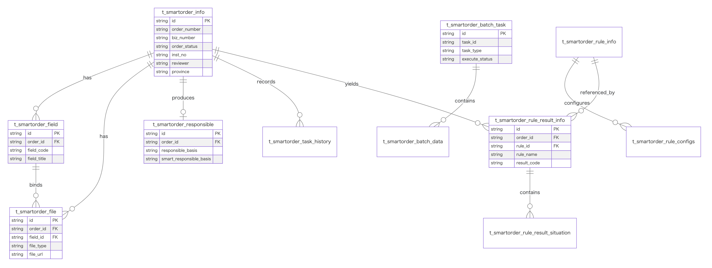

#### 核心业务表

| 表名                          | 作用         | 关键字段                                                                                                                         |
|-----------------------------|------------|------------------------------------------------------------------------------------------------------------------------------|
| `t_smartorder_info`         | 智能工单主表     | `order_number` `order_type_id` `biz_number` `order_tag` `order_status` `inst_no` `tenant_id` `reviewer` `writter` `province` |
| `t_smartorder_field`        | 分类模板字段表    | 字段编码、字段值、字段类型                                                                                                                |
| `t_smartorder_file`         | 工单附件表      | `order_id` `field_id` `file_source` `file_type` `file_url` `record_text` `standard_name`                                     |
| `t_smartorder_simply`       | 简化单主表      | 简化单类型、备注、关联工单                                                                                                                |
| `t_smartorder_simply_file`  | 简化单附件表     | 字段标题、字段类型、文件地址                                                                                                               |
| `t_smartorder_responsible`  | 智能/人工责任结果表 | `order_id` `responsible_basis` `responsible_situation` `smart_responsible_basis`                                             |
| `t_smartorder_task_history` | 工单流转历史     | `order_id` `task_id` `opera_user` `order_status` `node_name` `opera_name` `result`                                           |

#### 规则引擎相关表

| 表名                                   | 作用         | 关键字段                                                                                                                            |
|--------------------------------------|------------|---------------------------------------------------------------------------------------------------------------------------------|
| `t_smartorder_rule_info`             | 规则主表       | `rule_name` `expression_config` `rule_status` `rule_dict_code`                                                                  |
| `t_smartorder_rule_configs`          | 规则结果配置     | `rule_id` `result_code` `result_type` `conclusion_basis` `confidence_score`                                                     |
| `t_smartorder_scene_info`            | 规则场景表      | `scene_name` `scene_code` `scene_keywords`                                                                                      |
| `t_smartorder_rule_scene`            | 规则-场景关系    | `rule_id` `scene_id`                                                                                                            |
| `t_smartorder_scene_type`            | 场景-工单类型关系  | `scene_id` `type_id`                                                                                                            |
| `t_smartorder_rule_result_info`      | 规则执行结果表    | `order_id` `rule_name` `detection_status` `has_responsibility` `result_basis` `score` `responsible_id` `rule_code` `tag_result` |
| `t_smartorder_rule_result_situation` | 规则结果有责情形子表 | `result_id` `situation_name`                                                                                                    |

#### 批处理相关表

| 表名                        | 作用      | 关键字段                                                                                                                |
|---------------------------|---------|---------------------------------------------------------------------------------------------------------------------|
| `t_smartorder_batch_task` | 批任务主表   | `task_id` `task_name` `execute_status` `task_type` `data_count` `success_count` `fail_count` `file_url` `tenant_id` |
| `t_smartorder_batch_data` | 批任务数据明细 | `task_id` `data_id` `data_name` `deal_result` `fail_reason` `file_url` `usable_flag`                                |
| `t_smartorder_tag`        | 工单标签    | 工单与标签关联                                                                                                             |

#### 关系说明

1. `t_smartorder_info.id -> t_smartorder_file.order_id`
2. `t_smartorder_info.id -> t_smartorder_field.order_id`
3. `t_smartorder_info.id -> t_smartorder_responsible.order_id`
4. `t_smartorder_info.id -> t_smartorder_task_history.order_id`
5. `t_smartorder_rule_result_info.responsible_id -> t_smartorder_responsible.id`
6. `t_smartorder_rule_result_situation.result_id -> t_smartorder_rule_result_info.id`
7. `t_smartorder_batch_task.task_id -> t_smartorder_batch_data.task_id`

### 4.2.10 规则引擎设计

#### 规则执行机制

1. 根据工单类型、工单标签、简化单类型、业务标签，查询适用规则。
2. 将工单详情聚合成统一上下文：
   - 业务信息
   - 证明附件
   - 证明文字
   - 智能判责数据
3. 使用 `QLExpress` 执行表达式。
4. 根据命中的 `rule_configs` 生成“是否有责、结果依据、有责情形、可信度”等结果。
5. 执行结果落库到 `t_smartorder_rule_result_info` 与 `t_smartorder_rule_result_situation`。

#### 规则引擎的产品价值

1. 把经验规则从代码里剥离到配置表。
2. 允许“模型结果 + 显式规则”双轨并行。
3. 支持页面对每条规则做 trace、说明、标注、修正。

### 4.2.11 核心代码运行逻辑

#### 核心一：`OrderTaskCore`

职责：

1. 工单业务流转总调度。
2. 附件保存、简化单保存、审核复核、取回退回、批量导入后的业务拼装。
3. 与工作流、模型、规则引擎联动。

它相当于 `workorder` 的“业务编排中枢”。

#### 核心二：`SmartOrderNlpCore`

职责：

1. 前置模型判断有效单、重复单、工单标签。
2. 调用手机号归属接口。
3. 调大模型进行责任判断与理由生成。
4. 更新工作流变量与工单主表状态。

关键特点：

1. 前置判断和后置判责都归口到这里。
2. 同时协调 `NlpIntegration`、`GptIntegration`、`WorkflowIntegration`。
3. 直接驱动状态迁移。

#### 核心三：`SmartOrderCore`

职责：

1. 启动流程实例。
2. 根据 `isTrust`、`isRelease`、`isReview`、`isAppeal`、`isRetrieve`、`isReturn` 等变量推进 BPMN。
3. 维护主表状态与责任结果。
4. 落库智能责任记录，并与规则结果绑定。

可视为“工作流适配器 + 主表状态控制器”。

#### 核心四：`RuleExecCore`

职责：

1. 规则上下文构造。
2. 规则集合查询。
3. 表达式执行。
4. 规则执行过程缓存。
5. 规则调试异步执行。

关键特点：

1. 使用缓存承载规则执行进度。
2. 支持异步测试表达式。
3. 将文本、附件、模板标准问统一纳入上下文。

#### 核心五：`AutoDivideCore`

职责：

1. 根据时间窗口、业务标签、组织架构、任务上限自动分单。
2. 支持轮询式策略。
3. 与中台用户、部门、字典强耦合。

运行逻辑：

1. 找到生效分单规则。
2. 按标签查待分配工单。
3. 按标签查审核角色用户。
4. 校验组织架构前缀、任务上限、审核冲突。
5. 工作流推进并更新主表。

#### 核心六：`WorkOrderBatchTaskCore`

职责：

1. 批量报告解析。
2. 批量工单导入。
3. 批量测试集生成。
4. 任务/明细状态管理。

特点：

1. 支持主任务 + 明细任务两层模型。
2. 通过 `WAIT_EXECUTE -> RUNNING -> FINISHED/PAUSE` 状态机管理。
3. 适合离线数据处理和运营批量作业。

### 4.2.12 并发控制与高并发设计

#### 已实现的并发控制

1. `MybatisPlus` 乐观锁：防止并发更新覆盖。
2. `retrieveTask()` 使用 `synchronized`，避免同 JVM 重复取回。
3. Redis 执行标识：
   - `PRE_MODEL_STATUS_EXECUTING + orderNumber`
   - `POST_MODEL_STATUS_EXECUTING + orderNumber`
     用于避免模型任务重复执行。
4. `OrderTaskCore` 关键入口使用 `@DCHLock`，防止按钮重复提交。
5. Job 执行时通过 Redis 错误标记和运行标记跳过重复任务。
6. 自动分单通过内存 `taskCountMap + 工作流待办数` 控制任务上限。
7. 批任务通过主任务状态与子明细状态拆分，避免全局大锁。
8. `@Async(BIZ_TASK_EXECUTOR_NAME)` 用于附件解析等非阻塞任务。

#### 高并发控制建议

1. Redis 运行标记建议统一增加过期时间，避免异常情况下脏标记残留。
2. 自动分单若扩容到多实例，应把 `taskCountMap` 迁移为 Redis 或 DB 原子计数。
3. `retrieveTask` 当前只做 JVM 级别同步，若多实例部署建议补充分布式锁。
4. 模型调用与规则执行建议引入任务幂等表，避免异常重试导致重复落库。
5. 对 `t_smartorder_info(order_status, updated_at, province)`、`t_smartorder_rule_result_info(order_id, responsible_id)`、`t_smartorder_batch_task(execute_status, task_type)` 增强索引策略。

### 4.2.13 定时任务体系

| 任务     | 实现类                         | 作用                    |
|--------|-----------------------------|-----------------------|
| 前置模型任务 | `PrevOrderDealJobImpl`      | 处理待前置模型组任务，做有效单/重复单判断 |
| 智能判责任务 | `SimpleAndDutyOrderJobImpl` | 扫描待智能判责工单，执行大模型与后置逻辑  |
| 自动分单任务 | `SeparateOrderJobImpl`      | 根据规则自动把工单分给审核人        |
| 批处理任务  | `BatchTaskExecuteJobImpl`   | 执行报告解析/工单导入/批量测试      |
| 关单任务   | `CompleteOrderTaskJobImpl`  | 自动关闭满足条件工单            |
| 录音处理任务 | `RecordOrderDealJobImpl`    | 录音/转写相关任务             |

### 4.2.14 运维关注点

1. 工作流服务不可用会直接影响工单推进与待办展示。
2. 中台 Dubbo API 不可用会影响用户、角色、组织、分类查询。
3. 模型服务链路较长，应单独监控：
   - NLP
   - GPT 判责
   - 原因模型
   - ASR
   - OCR
   - 文件标准问识别
4. `SmartOrderProperties` 中配置项非常多，强依赖 Nacos。
5. 当前 `SmartOrderProperties` 存在大量模型 URL 和 token 配置，生产上必须确保通过安全配置中心托管，不建议代码仓库存放明文敏感信息。

### 4.2.15 量化容量指标与成因

以下指标基于当前代码中的默认阈值、线程池配置、分布式锁、Redis 运行标记与批任务拆分策略推导，属于保守工程估算。

| 指标项         | 建议规划值                                               | 代码与架构依据                                                              |
|-------------|-----------------------------------------------------|----------------------------------------------------------------------|
| 单次工单导入上限    | `2000` 单 / 批                                        | `SmartOrderProperties.maxImportLength = 2000`，导入前即做硬阈值校验             |
| 导入切片粒度      | 默认 `50` 单 / 小批次                                     | `SmartOrderProperties.batchImportLength = 50`，便于分段校验、分段落库与错误回写       |
| 单次报告分析上限    | `100` 份 / 批                                         | `SmartOrderProperties.maxAnalyzeLength = 100`，避免离线分析任务拖垮在线服务         |
| 单轮录音解析上限    | `30` 条 / 轮                                          | `SmartOrderProperties.limitNum = 30`，用于控制录音/OCR/ASR 类型任务的瞬时压力        |
| 单节点异步任务并发   | 以 `8C16G` 节点为例，建议 `24 ~ 48` 个异步任务并发                 | 业务线程池按 CPU 配置为 `2x ~ 4x`，计算线程池按 `1x ~ 2x`，并配套 `CallerRunsPolicy` 做反压 |
| 单节点智能判责日处理量 | 保守建议 `3000 ~ 6000` 单 / 日                            | 判责链路已异步化，且有 Redis 运行标记、规则结果拆表、任务历史分表；真正瓶颈主要在外部模型服务耗时                 |
| 双节点智能判责日处理量 | 保守建议 `6000 ~ 12000` 单 / 日                           | 主应用可水平扩容，瓶颈从单 JVM 转移到模型服务、流程引擎和数据库连接池                                |
| 待办池规模       | `审核人数 × 每人上限`，例如 `50` 人、上限 `100` 时，可稳定承载 `5000` 条待办 | 自动分单规则中已存在 `upperLimit`，并结合待办数与人员匹配逻辑进行限流                            |

为什么这些指标能够成立：

1. 导入、批分析、录音解析都有明确阈值，不会在入口无限放量。
2. 任务分成在线流转和离线批处理两条链路，避免互相抢占线程。
3. `DCHLock`、Redis 执行标记和 `synchronized` 组合，把“重复点击、重复判责、重复取回”这类并发问题拦在入口。
4. 规则结果、责任结果、任务历史单独落表，降低单表热点写入。
5. 异步线程池采用 `CallerRunsPolicy`，在线程池饱和时会自然降速，防止队列无上限堆积。

## 4.3 独立数据库 ER 与接口链路文档

### 4.3.1 双域数据库总览

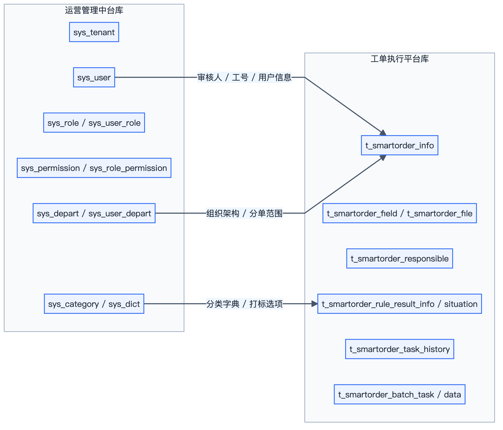

总览结论：

1. 运营管理中台库以租户、用户、角色、权限、组织、分类为主。
2. 工单执行平台库以工单主表、附件、责任结果、规则结果、任务历史、批任务为主。
3. 两边的耦合点主要不是数据库直连，而是通过 Dubbo 接口传递审核人、组织架构、分类字典、打标选项等业务对象。

### 4.3.2 运营管理中台单独 ER

### 4.3.3 工单执行平台单独 ER

### 4.3.4 Trace 数据模型单独 ER

### 4.3.5 中台侧接口清单

| 业务阶段      | 接口                   | 关键方法                                                      | 主要用途                    | 关键下游                                                                    |
|-----------|----------------------|-----------------------------------------------------------|-------------------------|-------------------------------------------------------------------------|
| 登录鉴权      | `SysLoginService`    | `login` `randomImage` `sendMessageByPhoneNumber` `logout` | 处理账号密码、短信码、4A、快捷登录和登出   | `SysUserCore` `SysTenantCore` `JwtUtil` `CacheManager` `SSOAuthService` |
| 当前人信息     | `CmsUserService`     | `querySysUserInfoByCondition` `querySysUserByusername`    | 供工单平台按账号、工号、手机号补全用户身份   | `CmsUserCore`                                                           |
| 菜单权限      | `CmsUserService`     | `querySysPermissionByUserName`                            | 登录后加载菜单树和按钮权限           | `system_role_permission` `system_permission`                            |
| 审核人 / 人员池 | `CmsUserService`     | `querySysUserByRoleCode` `queryReviewerList`              | 给工单池分单、抽检导出和审核人筛选提供人员集合 | `system_user` `system_user_role` `system_user_depart`                   |
| 分类字典      | `CmsCategoryService` | `queryCategoryByCodes` `queryCategorySonListByCodes`      | 给工单详情和打标结果补分类名称与选项      | `system_category`                                                       |

### 4.3.6 工单平台接口清单

| 场景         | 接口                             | 关键方法                                                              | 作用                     | 核心下游                                                                            |
|------------|--------------------------------|-------------------------------------------------------------------|------------------------|---------------------------------------------------------------------------------|
| 工作台        | `SmartOrderTaskService`        | `queryMyTask` `queryMyAllTask` `queryMyCompletedTask`             | 查询待办、全部、已办结工单          | `OrderQueryTaskService` `SmartorderInfoManager`                                 |
| 工单池        | `OrderPoolService`             | `selectAllOrderPoolPage` `selectOrderPoolUserPage` `handSubOrder` | 查询工单池、查询可分配人员、执行手工分单   | `SmartOrderCore` `WorkflowIntegration` `CmsUserIntegration`                     |
| 详情 / Trace | `SmartOrderTaskService`        | `queryTaskDetailsById` `queryRecordText`                          | 聚合详情、录音转写、trace/说明基础数据 | `OrderTaskCore` `CmsCategoryIntegration` `WorkflowIntegration` `RuleResultCore` |
| 历史         | `SmartOrderTaskHistoryService` | `queryLatestHistoryByOrderId`                                     | 查询流转历史，并补待确认倒计时        | `SmartorderTaskHistoryCore` `SmartOrderCore`                                    |
| 补充资料       | `SmartOrderTaskService`        | `fullSmartOrder`                                                  | 落模板字段、附件、简化单并推进流程      | `OrderTaskCore.appealSmartOrder`                                                |
| 审核 / 复核    | `SmartOrderTaskService`        | `auditSmartOrder` `reAuditTask`                                   | 保存人工判责并推进工作流           | `OrderTaskCore.auditSmartOrder` `OrderTaskCore.reAuditTask`                     |
| 逆向动作       | `SmartOrderTaskService`        | `retrieveTask` `returnTask` `releaseCompleteTask`                 | 处理取回、退回、释放等逆向流转        | `OrderTaskCore` `WorkflowIntegration`                                           |
| 确认 / 申辩    | `SmartOrderTaskService`        | `confirmAuditSmartOrder` `defendSmartOrder`                       | 完成确认、申辩、再次流转           | `OrderTaskCore.confirmAuditSmartOrder` `OrderTaskCore.defendSmartOrder`         |
| 规则调试       | `RuleExecService`              | `execRuleExpress`                                                 | 对单条规则做异步表达式测试和执行结果回看   | `RuleExecCore.execRuleExpress`                                                  |
| 定时归档       | `Job`                          | `CompleteOrderTaskJobImpl.execute`                                | 定时确认与归档                | `SmartOrderCloseCore.closeOrderTask`                                            |

### 4.3.7 接口清单与阶段链路图

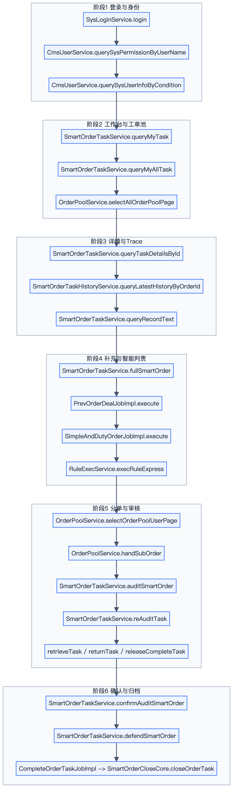

### 4.3.8 从用户登录到工单归档的全链路图

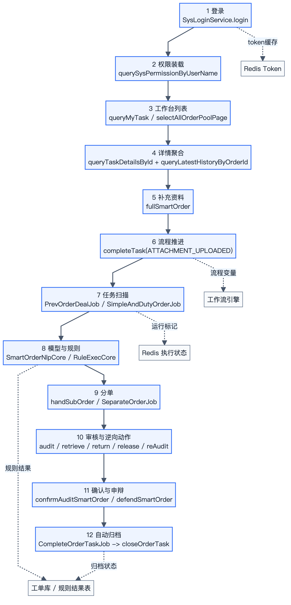

### 4.3.9 详细调用链路说明

1. 登录阶段：`SysLoginServiceImpl.login` 根据账号密码、4A `code` 或手机号三种入口分流，调用 `SysUserCore`、`SysTenantCore` 做用户与租户校验，最后通过 `JwtUtil` 生成 token，并写入 `CacheManager`。
2. 权限装载阶段：客户端拿到 token 后，会继续调用 `CmsUserService.querySysPermissionByUserName` 和 `CmsUserService.querySysUserInfoByCondition`，把菜单、按钮、角色、工号、组织等身份信息装载齐。
3. 工作台阶段：工单平台通过 `SmartOrderTaskService.queryMyTask`、`queryMyAllTask`、`OrderPoolService.selectAllOrderPoolPage` 获取当前人待办、全部任务和工单池数据。
4. 详情与 trace 阶段：点击工单后调用 `SmartOrderTaskService.queryTaskDetailsById`，内部走 `OrderTaskCore.queryTaskDetailsById -> SmartorderInfoManager.querySmartOrderDetailById`，同时补 `SmartOrderTaskHistoryService.queryLatestHistoryByOrderId`、分类选项、当前 `taskId`、Redis 执行进度和录音转写结果。
5. 补充资料阶段：填报人提交时调用 `SmartOrderTaskService.fullSmartOrder`，内部走 `OrderTaskCore.appealSmartOrder`，完成模板字段、附件、简化单、标签落库，并通过 `SmartOrderCore.completeTask` 把流程推进到智能判责。
6. 模型与规则阶段：定时任务 `PrevOrderDealJobImpl` 和 `SimpleAndDutyOrderJobImpl` 扫描待处理工单，内部调用 `OrderTaskCore.runExecuteTask`、`SmartOrderNlpCore`、`GptIntegration`、`RuleExecCore.execute`，最后把责任结果、规则结果和有责情形落库。
7. 分单与审核阶段：工单进入待分配后，走 `OrderPoolService.selectOrderPoolUserPage` 查候选审核人，再由 `handSubOrder` 或 `SeparateOrderJobImpl` 完成分单；审核阶段调用 `auditSmartOrder`、`reAuditTask`、`retrieveTask`、`returnTask`、`releaseCompleteTask` 处理正常和逆向流转。
8. 确认与申辩阶段：审核完成后调用 `confirmAuditSmartOrder` 进入确认链路；若业务发生争议，则调用 `defendSmartOrder` 保存申辩说明和申辩附件，再次进入后续流转。
9. 自动归档阶段：`CompleteOrderTaskJobImpl.execute` 定时扫描满足条件的工单，内部调用 `SmartOrderCloseCore.closeOrderTask`；若工单还在待确认，会先执行自动确认，再调用 `closedTask` 把状态推进到已归档。

---

## 5. 业务逻辑文档

## 5.1 整体业务角色

### 5.1.1 中台侧角色

1. 平台超级管理员：管理全平台租户、系统角色、全局能力。
2. 租户管理员：管理本租户用户、角色、部门、公告、业务标签。
3. 普通后台用户：按权限访问菜单与按钮。
4. 智能打标运营人员：上传文件、观察任务结果、修正数据。

### 5.1.2 工单平台侧角色

1. 填报人：补充工单材料、上传证据、维护基础业务信息。
2. 审核人：对待审核工单做初审。
3. 审核主管/复核人：对重点单据做复核。
4. 自动分单引擎：按照业务标签、组织架构、工作量分配任务。
5. 智能判责引擎：通过模型 + 规则完成预判。
6. 运营管理人员：查看看板、导出报告、批量测试、工单抽检。

## 5.2 工单执行平台业务流程

### 5.2.1 主流程

1. 省侧或运营人员批量导入申诉工单。
2. 系统创建工单主记录，并启动流程实例。
3. 前置模型判断：
   - 是否有效单
   - 是否疑似重复单
   - 是否简化单
4. 工单进入“待补充”。
5. 填报人补充业务信息、模板字段、附件、录音、手写报告。
6. 工单进入“智能判责”。
7. 系统执行：
   - 录音转写
   - OCR/附件内容抽取
   - 责任大模型
   - 责任原因模型
   - 规则引擎
8. 根据结果进入：
   - 待审核
   - 待复核
   - 待分配
9. 审核/复核后可发生：
   - 通过
   - 退回待补充
   - 释放回工单池
   - 进入申辩
10. 最终进入待确认并关单。

### 5.2.2 智能判责业务逻辑

智能判责不是单一步骤，而是三层组合：

1. 资料层：把工单基础字段、模板字段、附件、录音文本、手写报告解析成结构化输入。
2. 模型层：
   - 小模型负责重复单/简化单判断。
   - 大模型负责责任结论与理由生成。
3. 规则层：
   - 用规则对模型结论做补强与审计。
   - 把每条规则的检测结果可视化展示。

最终输出给业务页面的是：

1. 是否有责
2. 有责依据
3. 有责情形
4. 规则命中明细
5. trace 过程说明
6. 可人工修正的标注结果

### 5.2.2.1 Trace 业务逻辑

`trace` 在业务上不是一个“给技术看日志”的附属功能，而是审单链路里的正式判断工具：

1. 审核人先看最终结论，再通过 `trace` 判断这个结论到底经过了哪些规则步骤、哪些分支被执行、哪些分支被跳过。
2. 如果仅看结论还不足以支撑人工确认，审核人会进一步打开 `说明`，查看每一步的过程数据、模型输入和模型输出。
3. 当模型结果与人工经验冲突时，`trace` 可以帮助定位问题是在资料层、模型层还是规则层，从而决定是改判、退回补充，还是发起申辩。
4. 当运营需要做规则治理和模型治理时，`trace` 也是复盘入口，因为它能够把“为什么命中”“为什么未命中”解释成可审计的过程。
5. 因此，`trace` 的业务价值是把“智能判责结果”从黑盒结论，变成可复核、可追责、可修正的审单依据。

### 5.2.3 自动分单业务逻辑

自动分单遵循以下原则：

1. 只对待分配工单生效。
2. 只在分单规则定义的时间段内执行。
3. 根据工单标签/省份标签筛人。
4. 只把工单分配给拥有审核角色的用户。
5. 同时校验组织架构前缀是否匹配。
6. 控制每人当前待办上限。
7. 避免将复核或冲突工单再次分给原审核人。

### 5.2.4 人工审核业务逻辑

审核阶段的关键判断点：

1. 智能结果是否可信。
2. 资料是否齐全。
3. 责任结论是否成立。
4. 是否需要退回补充。
5. 是否需要申辩。
6. 是否需要复核。

这说明业务上对“智能判断”采取的是“辅助判定、人工兜底”的策略，而不是完全自动闭环。

### 5.2.5 看板业务逻辑

从截图可确认平台至少统计以下指标：

1. 所有工单量
2. 待补充、待审核、待复核、已归档等状态数
3. 智能判责工单量、待确认工单量
4. 工信部投诉量统计
5. 工单类型统计
6. 调用量统计、调用额度
7. 端到端准确率
8. 查全率
9. 结果可用率
10. 有责查全率、未发现有责查全率

业务含义是：

1. 平台同时关注运营效率。
2. 也关注模型效果。
3. 看板既服务业务管理，也服务模型治理。

## 5.3 运营管理中台业务流程

### 5.3.1 租户开通流程

1. 平台管理员创建租户。
2. 租户绑定套餐包。
3. 设置最大用户量。
4. 创建租户管理员。
5. 分配角色、菜单、部门。
6. 租户管理员进入日常运营。

### 5.3.2 用户管理流程

1. 租户管理员新增用户或批量导入用户。
2. 系统校验：
   - 用户名格式
   - 手机号格式
   - 账号唯一性
   - 手机号唯一性
   - 角色是否存在
   - 部门是否存在
   - 当前租户人数是否超过上限
3. 导入成功后更新租户 `user_nums`。
4. 用户登录后通过角色得到菜单与按钮权限。

### 5.3.3 登录业务流程

1. 账号密码登录：验证码 + 短信验证码双重校验。
2. 4A 登录：跳转获取 code，换 token，解析 4A 用户，映射平台用户。
3. 快速登录：按手机号定位平台账号。
4. 登录成功后：
   - 生成 JWT
   - 写缓存
   - 返回租户与身份信息

### 5.3.4 公告业务流程

1. 创建公告。
2. 指定公告范围：
   - 全员
   - 指定用户
3. 设置发布时间、撤销时间、打开方式。
4. 保存发送记录。
5. 前端按未读/已读/标星状态展示。

### 5.3.5 智能打标业务流程

1. 运营上传 Excel 文件。
2. 系统解析 Excel 为任务数据。
3. 调算法平台提交 `batch_id`。
4. 本地创建任务记录，状态置为“执行中”。
5. 定时轮询算法进度。
6. 结果完成后更新任务状态与结果信息。

## 5.4 双系统协同业务流

### 5.4.1 协同点

1. 运营管理中台管人、组织、租户、角色、分类。
2. 工单执行平台管单、流程、模型、规则、看板。
3. 工单执行平台的审核人、分单人、组织架构、分类标签都来自运营管理中台。
4. 运营管理中台的“智能打标”能力又可以服务工单执行平台的规则结果标注与模型治理。

### 5.4.2 协同价值

1. 底座和业务解耦。
2. 审单系统可以复用统一权限体系。
3. 组织变更、人员变更不需要在工单系统单独维护。
4. 模型治理、标签治理可以沉淀到中台。

## 5.5 业务量级与容量估算

### 5.5.1 说明

仓库中没有现成的压测报告，因此以下数字不是生产实测值，而是结合代码中的硬阈值、线程池规模、任务拆分方式和外部依赖结构得到的保守工程估算。

### 5.5.2 可量化指标

| 场景          | 建议量级                 | 说明                                      |
|-------------|----------------------|-----------------------------------------|
| 工单导入        | `2000` 单 / 批         | 入口已有硬阈值控制，适合按批次导入并回写错误明细                |
| 报告分析        | `100` 份 / 批          | 离线分析任务单次上限固定，避免与在线工单流转互相争抢资源            |
| 录音 / 附件解析   | `30` 条 / 轮           | 通过限流把 OCR / ASR 瞬时压力控制在可恢复范围内           |
| 单节点后台并发     | `200 ~ 300` 个中后台会话   | 中台类请求以分页、权限、查询、轻写入为主，Redis 承担热点状态       |
| 单节点智能判责     | `24 ~ 48` 个异步任务并发    | 线程池分为业务池、计算池、专用池，且使用反压策略防止队列失控          |
| 双节点智能判责日处理量 | `6000 ~ 12000` 单 / 日 | 以外部模型平均耗时可控、流程引擎和数据库正常为前提的保守规划值         |
| 审核待办池       | `审核人数 × 每人上限`        | 例如 `50` 名审核人员、每人上限 `100`，可承载 `5000` 条待办 |

### 5.5.3 这些指标为什么成立

1. 入口限流是显式的，不是靠运维兜底，导入、分析、录音解析都有固定阈值。
2. 执行链路做了分层，中台管理流量、工单流转流量、离线批处理流量不是完全混在一个线程模型里。
3. 重复提交和重复执行被多层拦截，包括 Redis 运行标记、`DCHLock`、乐观锁和部分入口的 `synchronized`。
4. 工单主表、规则结果表、任务历史表分离，降低了热点大表写冲突。
5. 真正的吞吐瓶颈在模型服务和流程引擎，不在普通 CRUD，因此系统可通过横向扩容主进程来继续放大处理能力。

---

## 6. 运维文档

## 6.1 部署架构

### 6.1.1 逻辑部署图

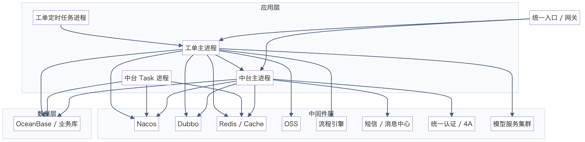

### 6.1.2 进程划分

#### 运营管理中台

1. `start`：主业务进程，对外暴露 Dubbo 服务。
2. `task`：任务/消费独立进程，用于与主服务拆分部署。

#### 工单执行平台

1. `start`：主业务进程。
2. `trigger + service/job`：通过 Job Proxy 驱动定时任务执行。

## 6.2 关键依赖

| 依赖                    | 作用                  | 两项目是否使用   |
|-----------------------|---------------------|-----------|
| Nacos                 | 配置中心/动态刷新           | 两者都用      |
| Dubbo                 | 服务治理与 RPC           | 两者都用      |
| DDS                   | 数据源切换/数据库能力         | 两者都用      |
| DCH / DCHLock         | 分布式协调/防重锁           | 中台与工单平台都有 |
| OceanBase 驱动          | 数据库访问               | 两者都用      |
| CacheManager/Redis    | token、验证码、状态缓存、执行标记 | 两者都用      |
| OSS                   | 文件上传下载              | 两者都用      |
| WebOS Flow / Activiti | 工单流程编排              | 工单平台重点使用  |
| 4A SSO                | 单点登录                | 中台使用      |
| 消息网关                  | 短信验证码               | 中台使用      |
| 模型服务集群                | 智能判责/ASR/OCR/NLP    | 工单平台使用    |

## 6.3 配置中心与启动方式

### 6.3.1 启动共性

两个项目都要求：

1. `spring.application.name` 正确。
2. Dubbo config center 指向 Nacos。
3. Nacos namespace/group/dataId 通过 JVM 参数注入。
4. 运行日志、SOFA tracer、Sentinel 等目录提前可写。

### 6.3.2 工单平台关键配置

`SmartOrderProperties` 中包含大量动态配置，主要分为：

1. 审单租户 ID
2. 角色编码
3. 根组织架构编码
4. 模型 URL
5. 模型 token
6. 批量导入/导出阈值
7. 录音解析开关与阈值
8. 自动关单天数
9. 规则调试参数

### 6.3.3 中台关键配置

中台关键动态配置包括：

1. `sys.tokenExpireTime`
2. `sys.auth-open`
3. `sms.switch`
4. `default.tenantId`
5. `filter.tenantId`
6. `sso.*`
7. `unite.signatureSecret`
8. `isExec` 初始化脚本开关

## 6.4 发布与部署建议

### 6.4.1 发布顺序

建议顺序：

1. 先发布 `运营管理中台`
2. 再发布 `工单执行平台`
3. 最后启用/恢复 Job Proxy 任务

原因：

1. 工单平台依赖中台接口
2. 分单、组织查询、分类查询都会调用中台

### 6.4.2 数据库变更策略

1. 工单仓库已有明显的增量 SQL 目录策略，如 `240515`、`240813`、`241029`。
2. 建议延续“按日期建目录”的方式进行变更留痕。
3. 发布时先执行 DDL，再滚动发应用。
4. 对规则表、结果表、批任务表的变更需先评估历史兼容。

## 6.5 监控与巡检

### 6.5.1 中台巡检项

1. 登录成功率
2. Redis token 命中率
3. 4A 登录成功率
4. 短信发送成功率
5. 用户导入失败率
6. 租户用户量与 `max_users` 差值

### 6.5.2 工单平台巡检项

1. 待补充、待审核、待复核、待确认积压量
2. 智能判责任务执行中数量
3. Redis 模型执行标记残留量
4. 工作流任务推进失败数
5. 模型调用超时率
6. 规则执行异常数
7. 自动分单成功率
8. 批处理任务成功率

### 6.5.3 建议告警

1. `SMART_RESPONSIBLE` 状态工单积压超阈值
2. 工作流 `queryLastTaskIdByInstNo` 连续失败
3. 模型调用超时率异常升高
4. 中台 Dubbo 调用失败率升高
5. Redis 不可达
6. Token 缓存异常增长

## 6.6 稳定性与风险

### 6.6.1 当前已具备的稳定性手段

1. 多数关键操作具备防重或状态校验。
2. 工作流状态和主表状态双重记录。
3. 规则执行结果单独落库，便于审计。
4. 工单历史操作单独留痕。
5. 看板可以观察模型质量与业务量。

### 6.6.2 当前主要风险

1. `workorder` 对外部模型依赖较重，模型超时会直接影响工单推进。
2. 一些运行标记依赖缓存，没有统一清理治理机制会产生残留。
3. 自动分单在多实例场景下仍有进一步增强空间。
4. `SmartOrderProperties` 中出现大量敏感 token 配置，安全风险较高。
5. 中台缺完整 DDL，数据库基线管理需要补齐。

---

## 7. 产品文档

## 7.1 运营管理中台产品逻辑

### 7.1.1 产品定位

一个服务于多个业务系统的统一后台中台，核心目标是：

1. 统一身份认证
2. 统一租户治理
3. 统一权限模型
4. 统一组织管理
5. 统一字典分类
6. 统一公告与辅助运营能力

### 7.1.2 主要对象

1. 租户
2. 套餐
3. 用户
4. 角色
5. 权限
6. 部门
7. 公告
8. 分类
9. 打标任务

### 7.1.3 主体产品逻辑

1. 平台先定义租户。
2. 租户拥有套餐和容量。
3. 用户属于租户。
4. 用户通过角色获得权限。
5. 权限决定菜单、页面、按钮的访问能力。
6. 公告、分类、字典等通用对象支撑各业务线。
7. 智能打标作为中台能力，为业务模型治理提供基础数据。

## 7.2 工单执行平台产品逻辑

### 7.2.1 产品定位

面向审单与定责场景的运营执行平台，产品目标不是简单建单，而是：

1. 让工单全流程在线化。
2. 让 AI 模型嵌入审单链路。
3. 让人工审核能够对 AI 结果进行确认、修正、追踪。
4. 让业务管理者看到工单量、效率和模型效果。

### 7.2.2 主要对象

1. 工单
2. 工单类型
3. 工单标签
4. 模板字段
5. 工单附件
6. 简化单
7. 规则
8. 规则结果
9. 分单规则
10. 批处理任务

### 7.2.3 产品核心逻辑

#### 逻辑一：工单不是静态记录，而是流程实例

工单主表 `t_smartorder_info` 里有 `inst_no`，说明每一张工单都绑定了流程实例，页面看到的待补充、待审核、待复核，本质上都是流程节点状态。

#### 逻辑二：智能判责不是黑盒，而是可解释链路

页面上不仅展示结论，还展示：

1. 规则项
2. 检测结果
3. 结果依据
4. 有责情形推荐
5. 涉及附件
6. trace 过程

这意味着产品设计明确要求“可解释、可复核、可审计”。

#### 逻辑三：人工与机器共治

产品并没有让模型直接决定关单，而是设置了：

1. 模型可信判断
2. 初审/复审
3. 退回
4. 释放回工单池
5. 申辩
6. 确认后关单

说明系统定位是“AI 辅助审单平台”，不是“全自动审批平台”。

#### 逻辑四：平台既服务日常生产，也服务模型运营

从看板和批量任务可以看到，系统同时支持：

1. 日常工单处理
2. 批量报告分析
3. 批量测试
4. 智能模型效果监控
5. 规则打标修正

这表示产品已经覆盖了“生产执行 + 模型迭代”的双场景。

## 7.3 两项目的产品边界

### 运营管理中台边界

做：

1. 人
2. 权
3. 组织
4. 租户
5. 公告
6. 分类
7. 打标

不做：

1. 工单主流程
2. AI 审单业务编排
3. 工作流推进
4. 审核复核闭环

### 工单执行平台边界

做：

1. 工单
2. 模型
3. 规则
4. 流程
5. 分单
6. 审核复核
7. 看板

不做：

1. 用户主数据维护
2. 租户生命周期治理
3. 通用权限中台

---

## 8. 核心代码清单与运行逻辑摘要

## 8.1 中台关键代码

| 类                               | 作用           | 说明                                  |
|---------------------------------|--------------|-------------------------------------|
| `SysLoginServiceImpl`           | 登录总入口        | 统一承接普通登录、4A 登录、快捷登录                 |
| `CustomUserDetailsService`      | token 与用户上下文 | Redis token 缓存 + Security Context   |
| `TenantAspect`                  | 租户切面         | 写入 `TenantContext`                  |
| `AuthAspect`                    | 鉴权切面         | 解析 JWT 并触发 `@PreAuthorize`          |
| `MybatisPlusSaasConfig`         | 多租户与分页/乐观锁   | 自动注入 `tenant_id`                    |
| `MybatisInterceptor`            | 审计字段自动填充     | `createdBy/updatedBy/tenantId` 自动写入 |
| `SysUserServiceImpl`            | 用户中心         | 导入导出、冻结解冻、批量操作                      |
| `SysRoleServiceImpl`            | 角色中心         | 角色授权、角色用户                           |
| `IntelligentMarkingServiceImpl` | 智能打标         | 任务提交、轮询更新                           |

## 8.2 工单平台关键代码

| 类                           | 作用          | 说明                               |
|-----------------------------|-------------|----------------------------------|
| `SmartOrderTaskServiceImpl` | 工单任务服务入口    | 详情、审核、复核、取回、退回                   |
| `OrderTaskCore`             | 工单业务编排核心    | 附件、简化单、审核流转、模型入口                 |
| `SmartOrderCore`            | 工作流与主表状态控制  | `startWorkFlow` + `completeTask` |
| `SmartOrderNlpCore`         | 前置模型与后置模型总控 | 有效单/重复单/判责模型                     |
| `RuleExecCore`              | 规则执行引擎      | QLExpress 表达式执行                  |
| `RuleResultCore`            | 规则结果落库      | 结果表与有责情形子表                       |
| `OrderPoolServiceImpl`      | 工单池与手工分单    | 查询、分单、人员冲突校验                     |
| `AutoDivideCore`            | 自动分单        | 时间窗口 + 标签 + 组织架构 + 上限控制          |
| `SimpleAndDutyOrderJobImpl` | 智能判责定时任务    | 扫描待判责工单并执行                       |
| `PrevOrderDealJobImpl`      | 前置模型定时任务    | 扫描前置模型组任务                        |
| `WorkOrderBatchTaskCore`    | 批处理平台       | 批量导入、报告解析、批量测试                   |

---

## 9. 总结

### 9.1 对项目现状的判断

这两个项目已经不是简单的“后台管理系统 + 工单 CRUD”，而是一个相对完整的“统一中台 + 智能审单业务系统”的组合：

1. 运营管理中台已经具备标准中台能力。
2. 工单执行平台已经形成“流程引擎 + AI 模型 + 规则引擎 + 人工审核”的完整业务闭环。
3. 从 BPMN 演进、截图看板和批任务体系看，项目已经进入持续优化阶段，而不是原型阶段。

### 9.2 最终结论

如果用一句更业务化的话概括：

1. `运营管理中台` 负责“把组织、人和权限治理好”。
2. `工单执行平台` 负责“把工单通过 AI 与流程治理好”。

二者共同组成了一个面向审单业务的生产级平台。

## 10. 总结

一个公司级“运营管理中台 + 工单执行平台”建设，项目面向审单定责与运营治理场景，其中运营管理中台负责多租户、用户、角色、权限、组织架构、分类字典、公告消息和智能打标等基础能力沉淀，工单执行平台负责工单导入、材料补充、前置模型判断、录音转写、OCR/PDF 解析、摘要预填、AI 智能判责、责任原因生成、规则引擎解释、trace 可追踪、自动/手工分单、审核复核、申辩确认与自动归档等核心业务闭环；技术栈基于 `Java`、`Spring Boot`、`Spring Security`、`Dubbo`、`MyBatis-Plus`、`Redis`、`Nacos`、`OceanBase/MySQL`、`QLExpress`、`Activiti/WebOS Flow`、`OSS` 构建，模型侧能力栈覆盖 `OCR/PDF OCR`、`ASR`、`NLP` 小模型、`GPT/通用大模型`、`OkHttp + JSON DTO` 模型服务接入与编排；重点负责多租户鉴权体系、工单业务编排、工作流推进、重复单/简化单小模型接入、摘要模型预填、审单定责大模型与责任原因大模型接入开发、模型结构化入参与结果解析、长文本裁剪与异常兜底、规则引擎执行链路、trace 可解释能力、批任务与定时任务体系、高并发防重与稳定性治理，项目核心逻辑是将“工作流引擎 + AI 模型 + 规则引擎 + 人工审核”打通为生产级审单平台，使智能判责结果具备可解释、可复核、可修正、可审计能力；平台具备单次导入 `2000` 单、单轮录音解析 `30` 条、单节点 `24 ~ 48` 个智能判责任务并发、双节点 `6000 ~ 12000` 单/日保守处理能力规划，能够同时支撑日常生产作业和模型治理优化，业务指标重点体现在批量进单效率、模型判责吞吐、人工复核承接能力和最终归档闭环稳定性上。